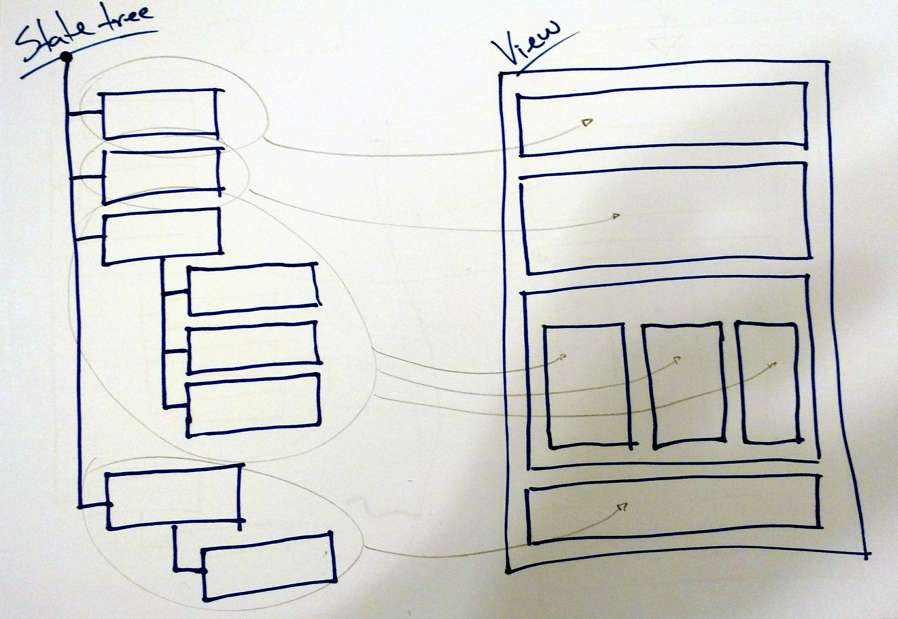
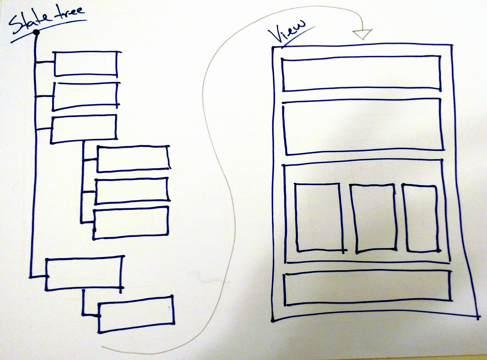

Front end programming is difficult. We are still figuring out how to best deal with it, and the quantity of frameworks and libraries that appear and disappear every week is a consequence of it.

At some point, Facebook launched the [React](https://facebook.github.io/react/) framework, which seemed to have "solved" the rendering part of front end programming. We all are getting used to React's syntax and virtual DOM algorithm, and it seems like a good pattern, both from the performance and productivity perspectives.

But we're still a little bit lost when it comes to managing the information being rendered. First everybody was using React with the MV-something patterns we have in Angular or Backbone. Then Facebook itself started talking about Flux and its unidirectional approach, and we started to see lots of Flux-inspired frameworks being released.

But in the "parallel world" of [ClojureScript](https://github.com/clojure/clojurescript), something very interesting was happening. The first big React wrapper for ClojureScript was [Om](https://github.com/omcljs/om), and it featured an intriguing *centralized state* concept.

It was new for me, and the first thing I and a lot of people thought was *but isn't anything global really bad? Specially global state???* Now, months later, the centralized state concept is proving itself very powerful and simple, with libraries like [Baobab](https://github.com/Yomguithereal/baobab) and specially [Redux](http://rackt.org/redux/) becoming the new standard ([Morearty](https://github.com/moreartyjs/moreartyjs) seems to have been the first one, but did not gain as much traction as the others).

In the last year I studied and implemented projects with some of these frameworks, and even implemented a centralized state from scratch a couple of times. In this post I will talk about the two design patterns you'll probably come accross when working with a centralized state.

## Update Listeners

I call the first design pattern the *Update Listeners* pattern. This pattern is used by the [Reagent](https://reagent-project.github.io/) framework, and by [Baobab](https://github.com/Yomguithereal/baobab) in the javascript world. I've [written about this before](http://lucasmreis.github.io/blog/a-more-functional-approach-to-angular/), and it's the pattern I use in my daily work.

The application state resides in a single tree object. Different UI components can *listen* to updates on different nodes of the tree, and the component is re-rendered every time that node is updated.

**PROS:** The main benefit of this pattern is that once the listeners are setup, the components get rendered automatically when the state is updated. That means that the UI is always reflecting the current state.

In terms of architecture, it's also a very interesting pattern because it makes it very clear which information from the state is being used in each visual component of the application.

Another *pro* is that the parent component does not need to have all the information that the child component needs to be rendered. This means that if I have a "post" component with "comments" child components, I only need to pass the comments' ids to each component. They will by themselves gather the necessary information to be rendered using the listeners.

**CONS:** Because of the code for the listeners, the components make assumptions about the how the state object works, and how the information itself is structured.

The [baobab-react](https://github.com/Yomguithereal/baobab-react) project illustrates some ways that the components can properly listen to changes in the main tree, and you can see how the components become dependent to the implementation of the application state object.

That way, the code of the components is not very generic and reusable, and the code of the application as a whole gets very tied to the library or framework used to handle the state.

## Manual Render

This pattern is used by the [Quiescent](https://github.com/levand/quiescent) framework, and I also used it when I wrote about [CSP as an application architecture](http://lucasmreis.github.io/blog/using-csp-as-application-architecture/).

The application state resides in a simple data structure, usually a javascript object. The whole UI is a function that accepts this state object as a parameter and render it. The developer calls the function "manually"; in other words, the UI does *not* react to changes in the application state.

**PROS:** The first immediate benefit is that the majority of your components will be *stateless*. That means they will be easier to reason about, and it's going to be easier to reuse them in different contexts and even different applications.

Also, having more control of when rendering takes place can make rendering itself be more effective and performant. A common way of dealing with it is taking advantage of `requestAnimationFrame` so there are no unecessary calls to `React.render` (as I have done [here](http://lucasmreis.github.io/blog/using-csp-as-application-architecture/)).

**CONS:** The cons of working with stateless components is that you have to pass every single information and callbacks to the components, every time you use them. This can lead to more confusing code than simple `<UserProfile id={userId} />`.

Not only that, if a stateless component needs a different piece of data, let's say the user's profile picture url, *the container component will have to pass this new piece of data*. Sometimes this can lead to multiple components needing to change because of one small change in a child component.

Another common and important problem is that, now that rendering is manual, we can forget to fire the render function, and our UI will be out of sync with the application state.

## Conclusions

First question is: which one is better? From my personal experience, the *Update Listeners* pattern really saved our lives once :) We had a big Angular application, with state distributed all over the code, and every new feature added a lot of complexity to it. Now it's much simpler and easier to both add new features and debug the code.

On the other hand, we're thinking of rewriting/refactoring four other applications. React is being considered as the view framework, and we want components to be as shareable as it gets. So, all the components receive data and callbacks as props, and make no assumptions on how the application is handling state. For this situation, the *Manual Render* seems like a better approach.

It's the usual but true conclusion: both design patterns have strengths and weaknesses, and each will work well depending on the situation.

## Last Thoughts

Not all state may belong to the centralized state tree. Animation state, for instance, seems to be better stored locally, in a React component's `state`. I'm still trying to figure out how to better deal with these situations, and where they would fit in these patterns.

This categorization is a work in progress. Has any of you seen centralized state being used in a different way? Or has any of you have any other "pros" and "cons" you would like to share? Any disagreement with the "pros" and "cons" listed here? I would love to hear from you! :)