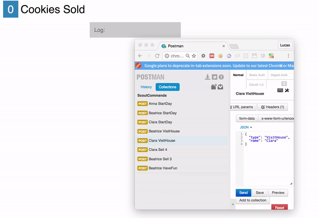
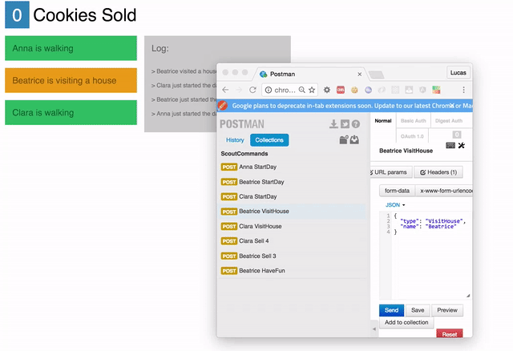

After [experimenting with Elm](http://lucasmreis.github.io/blog/learning-elm-part-1/), I was hooked. I could feel that working with a smart type system brought both *reliability*, in the sense of "it does what I wanted it to do", and *safety*, in the sense of "it does not have bugs".

Elm's main focus is the front end ([even though](https://github.com/ElmCast/elm-node) [some work](https://github.com/Fresheyeball/elm-http-server) [is being made](https://github.com/eeue56/servelm)), so a natural next question would be *how would it be using an Elm-like language in the server*? And by "Elm-like" I mean a language with immutable data structures as default, encouraging expressions over statements, and of course, having those cool discriminated unions we all learned to love. :)

After a quick research, the finalists were Haskell, Ocaml and F#. A former coworker was always saying good things about F#, and after seeing things like [FSharp.Data](http://fsharp.github.io/FSharp.Data/), [Xamarin](https://developer.xamarin.com/guides/cross-platform/fsharp/fsharp_support_overview/) and [this amazing blog](https://fsharpforfunandprofit.com/), I decided to go with F#.

## Setting Up

The first week with F# was not easy. I did not have any clue where to start since I don't have a Windows machine. So I downloaded Xamarin Studio, and used it for a couple of days. It's a good IDE with a so so editor, so I started looking for some alternatives.

Every F# project needs a `*.fsproj` config file, which is a big messy XML, that is not meant to be changed by "human beings" (as opposed to the simpler `package.json` from Node or `elm-package.json` from Elm). But it turns out that the F# open source community built some nice tools to deal with it. Summing up, install the [Ionide](http://ionide.io/) extension to VS Code or Atom, and everything will be easier.

My programming workflow then became: just start coding something, and "send" little by little code to the REPL. Define some types, send to the REPL. Write a function, send to the REPL. Write some use cases, send to the REPL. It's exactly the same workflow I used with Clojure, and it leads to a lot of early feedback and agility from the beginning.

With F# up and running, I decided to implement a simple project to learn the language.

## The Project

My wife was a girl scout when she was a kid. She told me that there's a famous girl scout activity in the US which is selling cookies door to door to neighbours. I found that extremely cute, and decided on implementing a girl scout cookie selling dashboard! :)

The requirements are: each scout somehow send commands like "Visit House" or "Sell 5 Cookies" to the server. The server validates the command, and broadcast events like "Maggie Just Visited A House" or "Lisa Just Sold 5 Cookies" to the dashboards, that are updated in realtime and consolidate all the information.

## The Domain Model

Each scout can be modelled as a "state machine". This is where these type systems really shine. F#, like Elm, has union types and pattern matching, so the code was pretty similar. For instance:

```fsharp
type ScoutState =
    | Walking
    | Visiting
    | HavingFun

type ScoutCommand =
    | StartDay
    | VisitHouse
    | Sell of int
    | HaveFun

type ScoutEvent =
    | DayStarted
    | HouseVisited
    | Sold of int
    | DayFinished

type ScoutError =
    | ShouldBeHavingFun
    | ShouldBeWalking
    | ShouldBeVisiting
```

A word about Commands and Events: when programming in Elm, "everything" that happened in the application was called a Message. The Update function understands the Messages, updates the state accordingly, and then emit or not new Messages.

When reading about F#, I came accross lots of reading materials on Domain Driven Design (DDD), Event Sourcing and Command Query Responsibility Segregation (CQRS). One of the nice ideas I've read is the *separation between Commands and Events* among the Messages.

Everytime a user wants to change the domain, it issues a Command. If the Command actually changes the domain, an Event is generated. An Event represents things that actually happened to the domain. For example, if a scout issues a Command `Sell 3`, the server checks if it's a valid Command for the actual State, and if it's ok it issues an Event `Sold 3`. If it's not valid, let's say the scout was not visiting any house, it returns a `ShouldBeVisiting` error, and the State is not updated.

The cool part is that we can store all the Events, and query it at will. The present State is a replay of all the past Events! That's what Event Sourcing is all about, and I really recommend watching [every video you can](https://www.youtube.com/watch?v=8JKjvY4etTY) [from Greg Young](https://www.youtube.com/watch?v=kZL41SMXWdM), [the "father" of the Event Sourcing pattern](https://www.youtube.com/watch?v=LDW0QWie21s).

With that in mind, this is the final state machine representation of the scouts:

-- PICTURE --

[The final code for the domain is here](https://github.com/lucasmreis/AmazingCookies/blob/master/src/Domain/Domain.fs).

## A Simple Event Store

The events produced by the server need to be stored somewhere. To continue the learning experience, I decided to implement the simplest in-memory event store I could think of. It should be able to store every event, broadcast them to listeners, and that's it.

Since the store actually stores data, and this data is accessed through methods, I thought that modelling the store as an *object* would be ok. Yes, it's an object of the kind we try to escape with functional programming, but it still has it uses :)

It was also good to see that "object oriented programming" with F# is very simple, and has almost no boilerplate. You just declare a type with `()` near the name, and declare "members" of the type. For instance:

```fsharp
type EventStore() =
    let eventList =
        new ResizeArray<String * ScoutEvent>()

    member this.Save(name, events) =
        events |> List.iter (fun e -> eventList.Add(name, e))

    member this.Get() =
        eventList
```

When instanced with `let store = new EventStore()`, this object creates an array of `String * ScoutEvent` tuples. This will hold all the events produced by the application, together with the scout's name that produced the event.

F# has a very interesting feature called *computation expressions*. [The docs](https://docs.microsoft.com/en-us/dotnet/articles/fsharp/language-reference/computation-expressions) describe it as *a convenient syntax for writing computations that can be sequenced and combined using control flow constructs and bindings*. I do not know an easier way to describe it, so let me show two examples, `async` and `seq`:

```fsharp
// First example

// this works just like Javascript's async/await,
// or Clojure's core.async
let asyncFetchedDocument = async {
    let url = "http://some-url.com/api"

    // this line will wait for the response without blocking the thread
    let! res = someAsyncFetchFunction url

    return res.data }

let fetchedDocument =
    Async.RunSynchronously asyncFetchedDocument


// Second example

// this produces a lazy sequence
let lazySeq = seq {
    for i in 1 .. 5 do
      if (i % 2 = 0) then
        yield i
        yield -i }

let list =
    Seq.toList lazySeq
// => [2; -2; 4; -4]

```

In the event store I wrote, I used a `query` computation expression to get all the events from a given name in the EventStore:

```fsharp
...

member this.Get(name) =
    query {
        for (n, ev) in eventList do
        where (n = name)
        select ev
    } |> Seq.toList

...
```

That's really cool, right? Feels like strong typed SQL :) I feel that Elm would strongly benefit from something like it.

So, to finish the EventStore, I needed a pub/sub to the saved events:

```fsharp
...

  let saveEvent =
      new Event<'Key * 'Event>()

  member this.SaveEvent =
      saveEvent.Publish

  member this.Save(name, events) =
      events |> List.iter (fun e -> eventList.Add(name, e))
      events |> List.iter (fun e -> saveEvent.Trigger((name, e)))

...
```

The events are published at `SaveEvent`, and saving an event triggers the listeners. An example subscription would be:

```fsharp

let logger ev = printfn "-- EVENT: %A" ev

store.SaveEvent.Add(logger)

```

[The complete EventStore, with generic typing, is here](https://github.com/lucasmreis/AmazingCookies/blob/master/src/EventStore/EventStore.fs).

## A Server

Years ago I worked with C#, and wrote a server with ASP.NET MVC. In this project, I thought I was going to write the server using F#/C# "interop" (and was not very happy about it :) ). How glad I was to come accross an "F# native" web server framework called [Suave](https://suave.io/). Suave in portuguese means *smooth*, and that's exactly how it feels to write a server with it!

For instance, look at the final code for the server:

```fsharp
let app store =
    choose [
        path "/"          >=> Files.sendFile "build/index.html" true
        path "/dashboard" >=> Files.sendFile "build/dashboard.html" true
        path "/websocket" >=> handShake (eventSocket store)
        path "/command"   >=> POST >=> request(commandRequest store)
        ServerErrors.INTERNAL_ERROR "Sorry, route not valid!" ]
```

Super clear, right? Writing this server was super easy. The routes are defined through function composition, and Suave comes with some functions that define standard server behaviors, like `Filters.POST`, `Files.sendFile` and `ServerErrors.INTERNAL_ERROR`.

I found one problem while trying to make it work: *there's simply no documentation on working with websockets*. After googling it, the material I had was a couple of StackOverflow questions, and [this example from the project github](https://github.com/SuaveIO/suave/blob/master/examples/WebSocket/Program.fs).

After these hours trying to make it work, I could make it work. This is part of the final code for the socket code:

```fsharp
...

socket {
    let loop = ref true
    while !loop do
        let! msg = webSocket.read()
        match msg with
        | (Ping, _, _) -> do! webSocket.send Pong [||] true
        | (Close, _, _) ->
            do! webSocket.send Close [||] true
            subscription.Dispose()
            loop := false
        | _ -> ()
    }
```

It's a computation expression! Gotta love those.

[The complete code for the server can be found here](https://github.com/lucasmreis/AmazingCookies/tree/master/src/Server).

## An Elm dashboard

After implementing all those F#, it was time to come back to Elm. The dashboard architecture was simple: the app listens for events through the native websockets implementation, and it drives the standard Elm architecture. That's how the final result looks like (notice I'm using Postman to send the scouts command to the server):




One of the best part of Elm is that the structure of the code does not seem to change from application to application I write. The "framework" part of it is so close to the language itself, that one simply does not try to do things in a different way - and I don't even think it's possible. That way we can focus more on the real complexity of the problem, and think less and less about implementation details.

The only different part from my [earlier](http://lucasmreis.github.io/blog/learning-elm-part-1/) [learning Elm](http://lucasmreis.github.io/blog/learning-elm-part-2/) [series](http://lucasmreis.github.io/blog/learning-elm-part-3/) is the websockets part. But it's really, really simple:

```
type Msg
    = EventReceived String

subscriptions : Model -> Sub Msg
subscriptions model =
    WebSocket.listen scoutEventsServer EventReceived
```

And now I just had to treat `EventReceived` messages in the `update` function.

Now something I did not like: I felt like I had to do a lot of repeated code in the client and the server, mostly in the models. Mismatches between client and server models are a huge source of errors. Although I don't think it would happen here - after all, they are in the same project :) - I would have to update two pieces of code everytime the model needed to change.

[The complete code for the dashboard is here](https://github.com/lucasmreis/AmazingCookies/blob/master/src/Client/app/Dashboard.elm).

## Final Conclusions

In the end, I really enjoyed the experiment. Even though the languages look similar, I could see lots of differences between the two, mostly due Elm being a language looking for reliability in a narrow scope, and F# looking for pragmatism in a much larger scope.

### Things Elm is superior to F#

* *"One way to do it", and it's very well thought.* After grasping the Elm architecture, it seems I think each time more about the complexities of the problem itself and less about incidental implementation complexities.

* *Elm is safer.* Elm's limitations to immutable data and pure functions makes everything safer in general. I cannot think of a way a runtime error can happen in an Elm app.

* *Elm-format diminishes the cognitive load*. Auto formatting is much more powerful than I thought it would be! It's one more tool to make you focus on the important problems. Just spend some days using it with Elm and then come back to any other language without a formatter and you'll understand how much we gain when we are not thinking about code formatting.

* *Better type signature syntax*. When one needs to write a function type signature, nothing beats Elm's (and for that matter Haskell's) signatures. I like stating the types in a different line than the function itself, and I even use it as a comment in some of my Javascript code, the way [RamdaJS uses it in its docs](http://ramdajs.com/0.22.1/docs/#repeat).

### Things F# is superior to Elm

* *F# is not focused in a single problem*. Basically you can use F# in almost any software domain, from web servers to web clients, from mobile apps to data science silos. So, knowledge gained in one domain, is knowledge brought to another.

* *F# is super pragmatic*. If you want to deal with async problems, you can choose from native implementations of goroutines, actors or observables. You can tackle a problem using many different paradigms, and you have the whole .NET ecosystem at you disposal. In this sense, it feels as pragmatic as Clojure to me, and that tends to help a lot most of the time.

* *Type inferring*. It just works, sometimes it feels like magic, and almost never gets in your way. Just start writing the function, and the compiler starts helping you. *Obs:* I found that a very good type inferring has one drawback: reading code on a web page. When you read code in an editor, you can always hover your mouse and it gives you information about everything, but when you don't have that tool to help you, code can be a little obscure to understand. That's not good when you are trying to understand a complicated piece of code on github.

* *Tooling / compiler gives you a lot of information during development*. Elm's error messages are a gem. They are amazingly helpful, but I feel that F#'s compiler helps you *more* during development. You can basically hover your mouse over anything in your code and you get information about it.

## Things I learned in the process

I learned some valuable lessons in this process. First of all, in the language level, I learned a lot on how to use types better. ML-style languages make it easier to use types to actively make your code more reliable. I recommend reading [this blog post series](http://blog.ploeh.dk/2016/02/10/types-properties-software/) as a masterclass in "making illegal states unrepresentable". It's a very powerful and simple idea that consists in using the type system as way to maintain the application in a valid state 100% of the time. Another way of phrasing it is ["testing is good, but impossible is better"](https://twitter.com/splodingsocks/status/776523774183301120) :)

And second, in the architecture level, I learned about Event Sourcing and CQRS. Today, I really think that *using event logs as first class citizens is the way to go in most situations*. Even in this small project, I could feel the benefits: whenever I was coming up with a new way of visualizing the scouts information in the dashboard, I never had to change any schema, or any code in the backend. "Read models" are only different queries in the stored events.

I feel that in a lot of companies, our main storage consists of "last states of a bunch of view models", and we spend a lot of money on different analytics, and log-managing tooling to deal with the really important business questions. If these companies already stored events, and treated them as they treat their main data, an imense value would be generated at a much lower cost.

## Next Steps

The repeated code between client and server made me curious about trying something more "unified", so I'll try some [Fable](https://fable-compiler.github.io/) for frontend programming.

Also, I'll also try using more Event Sourcing whenever I can :)
