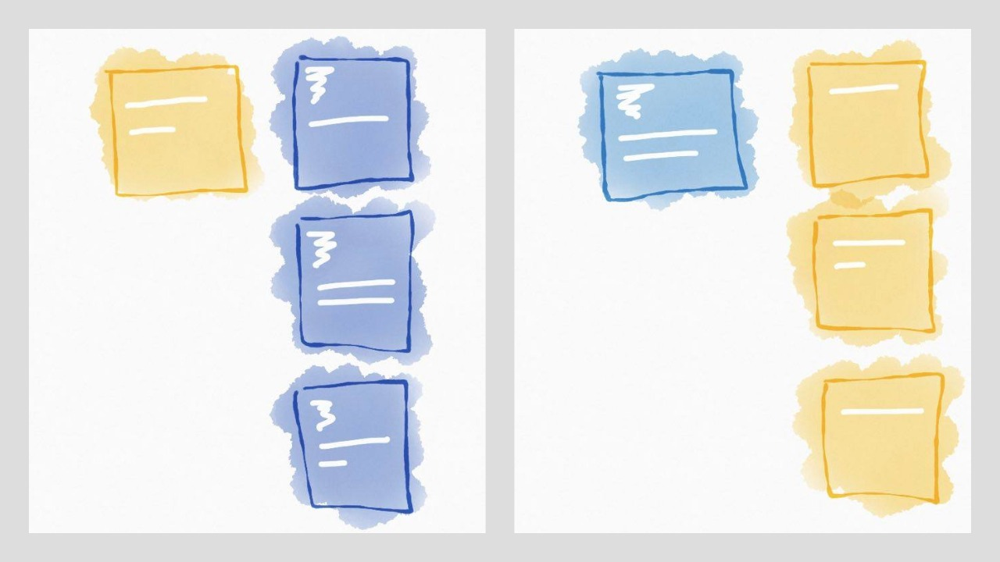

Some months ago I started a [quest to gain reliability in frontend development](http://lucasmreis.github.io/blog/learning-elm-part-1/). I chose Elm as the starting point, from this list:

1. Plain Javascript
2. Facebook Flow
3. TypeScript
4. PureScript
5. Elm

This was a ranking from "not reliable" to "reliable" frontend languages, mainly taking *types* into consideration. After programming with Elm a bit (and fidindg it awesome :) ), I started looking for [other languages with similar characteristics](http://lucasmreis.github.io/blog/does-elm-harmonize-with-f/#/). That was the time I found F#, and I'm really impressed by it.

It turns out that there's a F# to JS compiler called [Fable](http://fable.io/). In the ranking, it would be between Typescript and Purescript. It trades a bit of the "safety" for an easier Javascript interop.

In this post I'll "convert" the [star wars app I wrote in Elm](http://lucasmreis.github.io/blog/learning-elm-part-3/) to Fable, then I'll refactor it. Along the way, I'll compare the experience to both Elm and regular Javascript workflow.

For this post, I'll presume some familiarity with Elm or other ML languages, mainly that you understand how *discriminated unions* and *pattern matching* work. I wrote about the subject in [part one of the Learning Elm series](http://lucasmreis.github.io/blog/learning-elm-part-1/). Scott Wlaschin has probably the best blog on typed functional programming, and has written a [great article on F# discriminated unions](https://fsharpforfunandprofit.com/posts/discriminated-unions/).

Let's start!

## Starting A New Fable Project

Elm is very "beginner friendly" - it is the focus of that project since the beginning. This makes it very easy to just start playing with the language, be it with [Try Elm online](http://elm-lang.org/try) or using [Elm Reactor](https://github.com/elm-lang/elm-reactor) locally. Fable works more like a regular Javascript transpiler; so we need to do the initial pumbling, and then run our project through a local server.

Fortunately, it's simple. This is what I did: first I wrote an index.html file that imports a `build/bundle.js` script:

```html
<!doctype html>
<html>
<head>
  <meta http-equiv='Content-Type' content='text/html; charset=utf-8'>
  <title>Star Wars - Fable</title>
</head>
<body>
  <div id="app"></div>
  <script src="build/bundle.js"></script>
</body>
</html>
```

Then I globally installed the Fable compiler, and locally installed the `fable-core` and `fable-compiler` packages in the project:

```bash
$ npm install -g fable-compiler
$ npm init
$ npm install --save fable-core fable-compiler
```

Before writing the first F# file, please install the [Ionide extension](http://ionide.io/) to VS Code or Atom. It is very powerful, and makes the developing experience very pleasurable. The compiler realtime help is even *better* than Elm's! I'll talk more about this is the conclusion.

Now we can write a F# file, let's say in `src/Main.fsx`:

```fsharp
#r "../node_modules/fable-core/Fable.Core.dll"

open Fable.Import.Browser

console.log("It's working!")
```

I'll explain the syntax soon. Now we can build the project by using the `fable` command with some arguments:

```bash
$ fable src/Main.fsx --outDir ./build --rollup
```

I'm saying "build the `src/Main.fsx` file, and save the output in the `./build` directory. And please, bundle it using the [Rollup bundler!](http://rollupjs.org/)".

Now, as a last step, to run the built project, choose your favorite simple local server to serve the index.html. I've been using `http-server` and had no problems:

```bash
$ npm install -g http-server
$ http-server
```

Just head to `http://localhost:8080` and we're running! :)

## The .fsx File

The `Main.fsx` file is a F# script. That's the format we're going to use in this project. Let me explain our initial script:

* Usually in the beginning of the file, the external dependencies are listed. This is how regular F# dll's are imported:

```fsharp
#r "../node_modules/fable-core/Fable.Core.dll"
```

(If we want to import another .fsx file or a regular .fs F# file we will use the `#load` command)

* Then import the modules that'll be used:

```fsharp
open Fable.Import.Browser
```

This module imports the browser API, like `window` or `console`.

* Now you can write the application code:

```fsharp
console.log("It's working!")
```

That's everything that's on a fsx file. Now let's implement the Star Wars app using Fable.

## The Spec

As a reminder, let me rewrite here the application spec:

> The spec is simple: a Star Wars character "card" appears on the left, and corresponding film "cards", representing the films of the character, are shown on the right.

> Clicking on a film "card" displays it on the left, and a list of the characters that appear in the film are shown on the right. And it goes on.



*Characters cards will be yellow, and film cards will be blue. By clicking on a card, it changes from one screen to the other.*

## The Chosen Framework

[Fable's github page](https://github.com/fable-compiler) also houses two frameworks: [Fable Elmish](https://github.com/fable-compiler/fable-elmish) and [Fable Arch](http://fable.io/fable-arch/). Even though Elmish sounded like the one I would be more familiar with because of the previous Elm experience, I chose Arch because it has better documentation - or at least a clear list of sample apps :)

To use it, just install it like any npm library:

```bash
$ npm install --save fable-arch
```

An observation: Fable documentation in general is still not great. In fact, it's close to none if we compare to Elm or to a lot of Javascript libraries and frameworks. But the samples provided are really good and helpful, and I found them the best source for learning it in the first moments.

Another thing worth mentioning: there's a [Gitter channel](https://gitter.im/fable-compiler/Fable) dedicated to Fable. I asked a couple of questions there, and were promptly answered. The people who actually make Fable and the frameworks are there, and they are really trying to help everyone!

## The Character And Film Modules

First let's write the Character and Film modules. They only contain Model and View code. Let's start with the Character model:

```fsharp
#r "../node_modules/fable-core/Fable.Core.dll"

module Character =
    type Model =
        { name: string
          films: string list }
```

That is straightforward. Only small syntax differences from Elm, like not needing a comma or writing `string list` instead of `List String`.

Now the Character view:

```fsharp
#load "../node_modules/fable-arch/Fable.Arch.Html.fs"

open Fable.Arch.Html

(...)

    let mainStyle =
        Style
            [ "background-color", "rgba(230, 126, 34,1.0)"
              "width", "200px"
              "height", "200px"
              "color", "white"
              "font-family", "-apple-system, system, sans-serif"
              "margin", "20px 0px 0px 20px"
              "cursor", "pointer" ]

    let nameStyle =
        Style
            [ "padding", "20px"
              "font-size", "18px" ]

    let view model =
        div
            [ mainStyle ; onMouseClick (fun _ -> model) ]
            [ div [ nameStyle ] [ text model.name ] ]
```

The model code is very similar to the Elm version, but there's something important to be said here: *in F#, all code should be written in compile order*. That means that if you use a function or variable in another function, that should be declared before in the file. This is different from Elm, and from Javascript (if you declare a function with the `function` keyword). It seems this is a source of some debate in the F# community, since in regular F# projects you even need to specify the order that the files should be compiled! I have no problem with it. I tend to prefer that the `view` function comes first than the style variables, but I also see that forcing things to be in order can be beneficial to the understanding of the code.

The Film module is then very similar:

 ```fsharp
 module Film =
    type Model =
        { title: string
          episodeId: int
          characters: string list }

    let mainStyle =
        Style
            [ "background-color", "rgba(52, 152, 219,1.0)"
              "width", "200px"
              "height", "200px"
              "color", "white"
              "font-family", "-apple-system, system, sans-serif"
              "margin", "20px 0px 0px 20px"
              "cursor", "pointer" ]

    let nameStyle =
        Style
            [ "padding", "20px"
              "font-size", "18px" ]

    let numberStyle =
        Style
            [ "padding", "20px 20px 0px 20px"
              "font-size", "60px" ]

    let view model =
        div
            [ mainStyle ; onMouseClick (fun _ -> model) ]
            [ div [ numberStyle ] [ text (model.episodeId.ToString()) ]
              div [ nameStyle ] [ text model.title ] ]
 ```

## The Application Model And View 

Let's now define the application model:

```fsharp
type Model =
    | InitialScreen
    | LoadingFilms of Character.Model
    | LoadingCharacters of Film.Model
    | FilmsFromCharacter of Character.Model * Film.Model list
    | CharactersFromFilm of Film.Model * Character.Model list
    | ErrorScreen
```

The application model is a discriminated union, and I just adapted the syntax from the original Elm version. 

Let's convert the views one by one. First `InitialScreen`:

```fsharp
let messageStyle =
    Style
        [ "margin", "20px 0px 0px 20px"
          "width", "200px"
          "height", "200px"
          "font-family", "-apple-system, system, sans-serif"
          "color", "rgba(149, 165, 166,1.0)"
          "font-size", "18px" ]

let messageView t =
    div [ messageStyle ] [ text t ]

let view model =
    match model with
    | InitialScreen ->
        messageView "Loading amazing characters and films..."

    | _ -> 
        div [] []
```

To render the view, we need to call the run `createApp`. That's a little different from Elm's `Program`:

```fsharp
#load "../node_modules/fable-arch/Fable.Arch.App.fs"
#load "../node_modules/fable-arch/Fable.Arch.Virtualdom.fs"

(...)

open Fable.Arch
open Fable.Arch.App.AppApi

(...)

let update model msg = model , []

let initialModel = InitialScreen

createApp initialModel view update Virtualdom.createRender
|> withStartNodeSelector "#app"
|> start
```

`createApp` is direct: it needs an initial model, a view function, an update function, and a *renderer*. The renderer is the engine which will render your application view to the browser dom. Currently we can only use `virtual-dom`, which is a very fast and mature library, but it seems that [they are planning on having a React renderer too](https://github.com/fable-compiler/fable-arch/issues/33).

We need to install `virtual-dom` in our project:

```bash
$ npm install --save virtual-dom
```

Everything is looking good, right? But try compiling it. It doesn't, and outputs the error:

```bash
▶ fable src/Main.fsx --outDir build --rollup
fable-compiler 0.7.17: Start compilation...
Compiled fable-arch/Fable.Arch.Html.js at 11:35:51 PM
Compiled fable-arch/Fable.Arch.App.js at 11:35:51 PM
Compiled fable-arch/Fable.Arch.Virtualdom.js at 11:35:51 PM
Compiled src/Main.js at 11:35:51 PM
Bundling...
[BUNDLE ERROR] 'h' is not exported by node_modules/virtual-dom/index.js (imported by build/fable-arch/Fable.Arch.Virtualdom.js). For help fixing this error see https://github.com/rollup/rollup/wiki/Troubleshooting#name-is-not-exported-by-module
(...)
```

We're using Rollup to bundle the files. It turns out that Rollup works well with ES6 modules, but may break when using regular CommonJS modules. Since some libraries are written using CommonJS, we need to deal with these cases properly.

We need to configure Rollup to see the `virtual-dom` module and it's exported functions, so let me introduce you to the `fableconfig.json` file.

Instead of calling `fable src/Main.fsx --outDir ./build --rollup` every time, we can put the compiling configuration inside `fableconfig.json`. For example, if we have this config:

```json
{
  "outDir": "build",
  "projFile": "./src/Main.fsx",
  "sourceMaps": true
}
```

We can just run `fable`  or `fable --watch` in the terminal and get the same output plus a sourcemap.

Now we can add the Rollup CommonJS configuration:

```json
{
  "outDir": "build",
  "projFile": "./src/Main.fsx",
  "sourceMaps": true,
  "rollup": {
    "plugins": [
      ["commonjs", {
        "namedExports": {
          "virtual-dom": [ "h", "create", "diff", "patch" ]
        }
      }]
    ]
  }
}
```

This step is a small complication in our build system. It's definitely more complex than anything related to an Elm project build, but, on the other hand, it's the effect of using a very good and used *Javascript* tool. Efficient bundles are a central an important issue in frontend projects, and since we cannot escape from it, I actually like that we are using a good tool for that.

## Messages And The Rest Of The Views

Before building the other views, let's define the application Messages. As a reminder: a message is a description of a user action or an event that happens in the application. It is a model of the state *transitions*. Converting the original messages we have:

```fsharp
type Msg
    = LoadCharacters of Film.Model
    | ToCharactersFromFilm of Film.Model * Character.Model list
    | LoadFilms of Character.Model
    | ToFilmsFromCharacter of Character.Model * Film.Model list
    | FetchFail
```

Remember that both Character's and Film's have a `onMouseClick (fun _ -> model)` attribute. This means that the views emit a message of type `Model` when clicked. So, let's *map* those views to views that emit messages of type `Msg`:

```fsharp
let mappedCharacterView model =
    let characterView = Character.view model
    Html.map LoadFilms characterView

let mappedFilmView model =
    let filmView = Film.view model
    Html.map LoadCharacters filmView
```

Let's, just for fun, refactor `mappedCharacterView`. First of all, we can identify a *pipeline* there: we transform our model with the `view` function and then we map it to `LoadFilms` message. That translates directly to code:

```fsharp
let mappedCharacterView model =
    model
    |> Character.view
    |> Html.map LoadFilms
```

Which is already simple and clear. There's another F# operator, the `>>`. It composes two functions into another one, in the same order as `|>`. The next rewrite has the same behavior:

```fsharp
let mappedCharacterView model =
    let transform = Character.view >> Html.map LoadFilms
    transform model
```

When I see a function like that, I immediately think that `model` and `transform` are temporary variables that do not add a lot to readability. So I think this is a nice case where a [point free function]() is simple:

```fsharp
let mappedCharacterView =
    Character.view >> Html.map LoadFilms

let mappedFilmView =
    Film.view >> Html.map LoadCharacters
```

And now we can convert the rest of the views of the application:

```fsharp
let view model =
    match model with
    | InitialScreen ->
        messageView "Loading amazing characters and films..."

    | LoadingFilms ch ->
        div [ Style [ "display", "flex" ] ]
            [ mappedCharacterView ch
              messageView ("Loading " + ch.name + " films...") ]

    | FilmsFromCharacter (ch, fs) ->
        let filmsView = List.map mappedFilmView fs
        div [ Style [ "display", "flex" ] ]
            [ mappedCharacterView ch
              div [] filmsView ]

    | LoadingCharacters f ->
        div [ Style [ "display", "flex" ] ]
            [ mappedFilmView f
              messageView ("Loading " + f.title + " characters...") ]

    | CharactersFromFilm (f, chs) ->
        let chsView = List.map mappedCharacterView chs
        div [ Style [ "display", "flex" ] ]
            [ mappedFilmView f
              div [] chsView ]

    | ErrorScreen ->
        messageView "An error ocurred. Please refresh the page and try again - and may the Force be with you!"
```

The syntax is very clean. I like not having to use commas when changing lines, and don't mind the occasional parenthesis. I love Elm Format and how it formats your code automatically - F# doesn't have it, but I don't feel a loose a lot of time with code formatting to get a good look and feel.

Now we can try the views with "mock" application states, for instance:

```fsharp
let char:Character.Model =
    { name = "Luke Skywalker" ; films = [] }

let film:Film.Model =
    { title = "A New Hope" ; episodeId = 4 ; characters = [] }

let initialModel =
    FilmsFromCharacter ( char , [ film ; film ; film ] )
```

Run `fable && http-server` and reload the browser, and there you see it!

## The Update Function And Async Work

Fable Arch resembles Elm in the sense that the `update` function returns a new model and a list of "actions". Actions are functions that receive a `handler` callback parameter; `handler` is a function that receives a `Msg` and feeds it back to the update function.

Let's start with the initial work of the application: getting a character from the API, and transitioning from `Initial Screen` to `LoadingFilms of Character.Model`. 


. Json Encoders / Decoders

. Talk about type inference

. Side effects: list of callbacks

. fetch: just a JS function

. Refactoring: one Entity model (could be done in Elm)

. Simple, relatively easy, still reliable, performant
