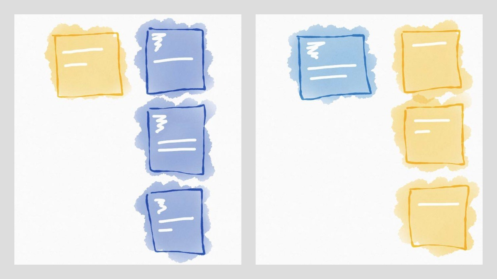
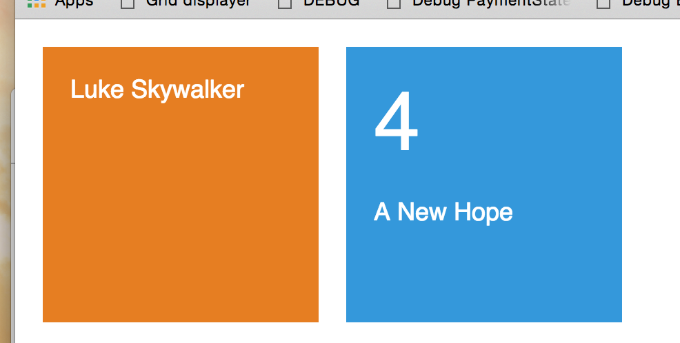

*This is part 3 of a series. Click here to read [part 1](http://lucasmreis.github.io/blog/learning-elm-part-1/) and [part 2](http://lucasmreis.github.io/blog/learning-elm-part-2/).*

It's time for some interaction with APIs! *Now* we can say that we're building an actual web application, and we'll really be putting Elm to the test.

So, why not implement a Star Wars themed app?

## Spec

The spec is simple: a Star Wars character "card" appears on the left, and corresponding film "cards", representing the films of the character, are shown on the right.

Clicking on a film "card" displays it on the left, and a list of the characters that appear in the film are shown on the right. And it goes on.



*Characters cards will be yellow, and film cards will be blue. By clicking on a card, it changes from one screen to the other.*

## Film And Character Components

I'll build both the Character and Film components in separate files. This is the initial implementation:

```
-- Character.elm

type alias Model =
    { name : String
    }


view model =
    div [ mainStyle ]
        [ div [ nameStyle ] [ text model.name ] ]

-- imports and styles omitted for brevity...
```

```
-- Film.elm

type alias Model =
    { title : String
    , episode_id : Int
    }


view model =
    let
        chapter =
            toString model.episode_id
    in
        div [ mainStyle ]
            [ div [ numberStyle ]
                [ text chapter ]
            , div [ nameStyle ]
                [ text model.title ]
            ]
```

If these examples do not feel straightforward to you, refer back to [Part 2](http://lucasmreis.github.io/blog/learning-elm-part-2/).

To preview the views and fine tune the CSS, I'll create the `Main.elm` file and run Elm Reactor pointing to it:

```
main =
    Html.App.beginnerProgram
        { model = model
        , view = view
        , update = update
        }


update model =
    model


sampleCh : Character.Model
sampleCh =
    { name = "Luke Skywalker"
    }


sampleFilm : Film.Model
sampleFilm =
    { title = "A New Hope"
    , episode_id = 4
    }


model =
    ( sampleCh, sampleFilm )


view ( ch, film ) =
    div []
        [ Character.view ch
        , Film.view film
        ]
```

That should render a sample component of each. Now it's time to start modeling our application.



## The Application Model

Our spec specifies two "application states": a character with a list of films, or a film with a list of characters. A natural model for this spec would be:

```
-- MODEL
-- Aliases added for reading simplicity


type alias C =
    Character.Model


type alias F =
    Film.Model


type Model
    = FilmsFromCharacter C (List F)
    | CharactersFromFilm F (List C)
```
To build the view, I will once again define a sample model:

```
model =
    FilmsFromCharacter sampleCh
        [ sampleFilm
        , sampleFilm
        , sampleFilm
        ]
```

And then, I'll use it to define the view, while refreshing Elm Reactor:

```
view model =
    case model of
        FilmsFromCharacter c fs ->
            div [ twoColumns ]
                [ Character.view c
                , div [] (List.map Film.view fs)
                ]

        CharactersFromFilm f cs ->
            div [ twoColumns ]
                [ Film.view f
                , div [] (List.map Character.view cs)
                ]


twoColumns =
    style [ ( "display", "flex" ) ]
```

Just change the sample and it works very well!

So, as a next step, I want to make the application retrieve actual information from the API. This is where things are different from [part 2](http://lucasmreis.github.io/blog/learning-elm-part-2/), because now our update function not only deals with the model, it also deals with *Commands*.

## The Command

Because this scenario is much more complex, instead of using the  `beginnerProgram` , we'll use the `program` function. It's a little different:

```
main =
    Html.App.program
        { init = ( model, Cmd.none )
        , view = view
        , update = update
        , subscriptions = subscriptions
        }

-- (...)

update msg model =
    ( model, Cmd.none )

-- (...)

subscriptions x =
    Sub.none
```

So, now instead of only a model, we have `init`. It is a tuple with a model to be rendered immediately and a command that will fire the update function in the future. Another thing to point out is that the update function also returns this same combination.  Subscriptions are listeners that can also fire the update function.

Our next step is to build 	`init`.  First, the app needs to get an initial character from the API and render it on the screen. Then, it has to render the films corresponding to that character. The http request will be the command, and I need an application state to wait for the request to complete.

*A Key Takeaway:* Elm architecture is designed in such a way that it showed me how I completely missed an important screen in my initial design of the page. At this point, it's clear to me that I need an *initial loading screen* :)

```
type Model
    = InitialScreen
    | FilmsFromCharacter C (List F)
    | CharactersFromFilm F (List C)

(...)

view model =
    case model of
        InitialScreen ->
            simpleMessage "Loading amazing characters and films..."

(...)

simpleMessage t =
    div [ simpleMessageStyle ] [ text t ]
```

The elm-http `get` function receives a "Decoder" and a url. The decoder is the function that will convert the json response to a character model. So it makes sense that it's inside the Character module, right?

Another thing that we realize at this point is that *I'll have to have the list of the films the character was in!* Of course. So let's change the model to also store the films' urls that'll be in the character card returned by the API:

```
-- Character.elm
import Json.Decode exposing (Decoder, succeed, string, list, int, (:=))
import Json.Decode.Extra exposing ((|:))

(...)

type alias Model =
    { name : String
    , films : List String
    }


characterDecoder : Decoder Model
characterDecoder =
    succeed Model
        |: ("name" := string)
        |: ("films" := list string)

```

The `|:` comes from the `elm-community/elm-json-extra` package, and feels like a better way to parse a json than the standard library.

So now I have the decoder. Let's go back to Main and implement the `getCharacter` command for init:

```
import Http

(...)

getCharacter url =
    Http.get Character.characterDecoder url
```

As soon as we define the `init` as `init = ( InitialScreen, getCharacter "http://swapi.co/api/people/1/" )` we'll receive the following message from the compiler:

```
The argument to function `program` is causing a mismatch. - Function `program` is expecting the argument to be:

    { init : ( Model, Cmd a )

(...)

But it is:

    { init : ( Model, Platform.Task Http.Error Character.Model )

(...)
```

That means `getCharacter` is not returning a command, it's returning a `Task`. A task is actually a *representation* of an action that has not happened, and may or may not fail. To run the task, we need to feed it to the `Task.perform` function:

```
getCharacter url =
    url
        |> Http.get Character.characterDecoder
        |> Task.perform FetchFail LoadFilms
```

Now the task will run, and it's going to return a `Msg` of type `FetchFail Http.Error` if it fails, or a `LoadFilms Character.Model` if it succeeds. These two types should be part of the `Msg` that is sent to the update function:

```
type Msg
    = LoadFilms C
    | FetchFail Http.Error
```

We also need to handle those two messages in our update function. Elm architecture, once more, reminds us that we haven't planned all the possible application states: we need an error state, and a "I have a character and I'm waiting for the films" state:

```
type Model
    = InitialScreen
    | ErrorScreen
    | WaitingForFilms C
    | FilmsFromCharacter C (List F)
    | CharactersFromFilm F (List C)


type Msg
    = LoadFilms C
    | FetchFail Http.Error


update msg model =
    case msg of
        FetchFail _ ->
            ( ErrorScreen, Cmd.none )

        LoadFilms c ->
            ( WaitingForFilms c, Cmd.none )


view model =
    case model of
        InitialScreen ->
            simpleMessage "Loading amazing characters and films..."

        ErrorScreen ->
            simpleMessage "Sorry, there was an error. Please try again!"

        WaitingForFilms c ->
            div [ twoColumns ]
                [ Character.view c
                , simpleMessage "Loading Films..."
                ]

(...)
```

## Good Tools Nudge You in the Right Direction

I'd like to express once again how awesome Elm is to have pointed out that alternative application states were needed. I "naively" thought only two screens were needed, and in reality I needed five :)

The concept of a tool "nudging" you to better practices was first introduced to me in a Rich Hickey, inventor of Clojure, video (any video of him is well worth your time!).

This also led me to conclude that Javascript is always nudging us in the *wrong* direction. Rich Hickey, for example, made Clojure so that, if you are in a hurry, you can work with immutable variables. You have to go out of your way to mutate values using that tool, and that's good, because mutations are a big source of unnecessary complexity.

Compare that to Javascript: it's always easier to mutate everything, change variables outside the function scope, write functions that are impure... So that means that you are nudged *towards application complexity* when using Javascript!

Elm, on the other hand, is always nudging me towards writing good code. I feel not only that I'm writing code in a clean way, as I do with Clojure, but I'm also building *the whole application* in a clean and complete way. I feel I'm building every view necessary for every state the application will be in, and every error will be properly treated.

That's an awesome feeling. :)

## Almost Finishing Our Application...

We are almost there! First of all let's implement the function that, given a character, it gets all the corresponding films.

*Important:* We'll use the `Task.sequence` to batch all the tasks, but this is definitely not the best way to do it; these requests could and should be parallel. I invite you to suggest a better way to do it in the comments!

```
-- Film.elm

type alias Model =
    { title : String
    , episode_id : Int
    , characters : List String
    }


filmDecoder : Decoder Model
filmDecoder =
    succeed Model
        |: ("title" := string)
        |: ("episode_id" := int)
        |: ("characters" := list string)
```

```
-- Main.elm
type Msg
    = LoadFilms C
    | FetchFail Http.Error
    | ToFilmsFromCharacter C (List F)

update msg model =
    case msg of

(...)

		LoadFilms c ->
            ( WaitingForFilms c, getFilmsFromCharacter c )

		ToFilmsFromCharacter c fs ->
            ( FilmsFromCharacter c fs, Cmd.none )

(...)
```

There's only one detail missing from our components: they need to produce a message when clicked. I implemented it so each component would send a message with its model, so the update function would be able to use the list of films' or characters' urls:

```
-- Character.elm
import Html.Events exposing (onClick)

(...)

view : Model -> Html.Html Model
view model =
    div
        [ onClick model
        , mainStyle
        ]
        [ div [ nameStyle ] [ text model.name ] ]
```

The type signature leaves it very clear: our view receives a Model, and returns an Html that produces messages of type Model. Good.

Now, when we use those views in our Main view, we need to add information to them in order to produce a valid message. For instance, if we click a character, it will send a message of type `Character.Model` (or `C`). But our application will only understand a message of type `LoadFilms C`. So we need to call the Character view function and *map* the message it sends with the `LoadFilms` tag. It's easier to demonstrate than to explain:

```
msgMap =
    Html.App.map

view model =
    case model of

(...)

    WaitingForFilms c ->
            div [ twoColumns ]
                [ msgMap LoadFilms (Character.view c)
                , simpleMessage "Loading Films..."
                ]

    FilmsFromCharacter c fs ->
            let
                filmsViews =
                    fs
                        |> List.map Film.view
                        |> List.map (msgMap LoadCharacters)
            in
                div [ twoColumns ]
                    [ msgMap LoadFilms (Character.view c)
                    , div [] filmsViews
                    ]

(...)
```

From now on, it's a "complete the puzzle" game. Just fill in the blanks asked by the compiler one by one, and the application will be ready and working.

## Next Steps

I can see two clear next steps for the app: making the requests parallel, and using animations for the transitions between the application states. As I said before, any ideas are welcome.

[Here's the working app](http://lucasmreis.github.io/star-wars-elm/)!

[And here's the complete code](https://github.com/lucasmreis/learning-elm/tree/master/part-3/app/elm).

## Conclusions

Elm is awesome. The fact that the compiler asks you to take care of the union types in a pattern match, makes it very difficult to forget something. Actually, after compiling the code, the application worked perfectly on the first shot. I was looking for reliability, and I found it!

There's a new component that I was not aware of before, that became clearer with this new exercise: the psychological impact of a strong compiler. Whenever your code is not compilable, solving issues feels like *solving puzzles*, and actually *building something*  And, every time it compiles and we refresh the Elm Reactor window, we see *something working*.

With Javascript I feel like things are always breaking and I have to fi them little by little. Runtime errors generate frustration, and even when we solve them, they still bring thoughts like *did I really stop it from breaking? Will it break in production in some unexpected way? Did I really deal with all the possible cases?*

Of course this is a personal observation, but I felt I should note it in case it resonates with other people facing the same struggles.

So, that was Part 3. Feel free to post any questions you might have!