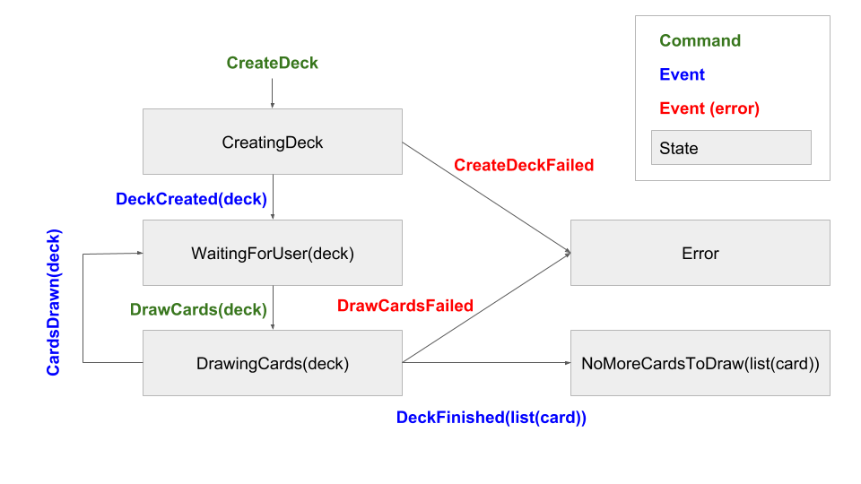

In the [last part of this series,](http://lucasmreis.github.io/blog/learning-reasonml-part-2/) we wrote some simple React components with ReasonML. In this third part, we're going to write a component that not only has state, but also _generates side effects_ through fetching an external API.

## Modelling User Actions

This is the [application's main module](https://github.com/lucasmreis/learning-reasonml/blob/master/part-2/src/App.js), which contains the side effects:

```js
class App extends Component {
  componentDidMount() {
    // fetch API to create deck
  }

  render() {
    return (
      <div className="App">
        {this.renderMainAction()}
        {this.renderCards()}
      </div>
    );
  }

  renderMainAction() {
    // render button
    // disable it depending on current state
  }

  renderCards() {
    // render list of cards
  }

  draw = async () => {
    // fetch API do draw cards
    // pass as a callback to the main action button
}
```

We can see that there are two main actions that trigger side effects: creating a deck on mounting, and drawing new cards on button click. Remember that side effects of this nature - fetching something from a network - have to take into account that things can get _slow_ and they can _fail_. Having said that, we usually model actions with side effects as _three different_ actions:

```js
type action =
  /* Create Deck */
  | CreateDeck
  | DeckCreated(deck)
  | CreateDeckFailed
  /* Draw Cards */
  | DrawCards(deck)
  | CardsDrawn(deck)
  | DrawCardsFailed
  | DeckFinished(list(card));
```

I added a `DeckFinished` action so our application can transition to a finished state that only shows the cards, and do not show the action button anymore.

Some actions have data related to them: `deck` and `list(cards)`. These types are related to the action state, and are inspired by the API response:

```js
type card = {
  image: string,
  code: string
};

type deck = {
  deckId: string,
  remaining: int,
  cards: list(card)
};
```

The `deckId` info is used to draw cards from the same deck that was created in the beginning of the application lifecycle. `remaining` is the information we use to decide if we already drew all the cards. For instance, we check `remaining` to decide if we issue a `CardsDrawn` action or `DeckFinished`.

**Note:** I like to follow this `CQRS` convention of [writing events in the past tense, and commands in the imperative](http://cqrs.nu/Faq). In summary, it means that an action that's written in the imperative will _trigger_ a side effect, and its results are unknown. And actions that are written in the past tense are actions that will trigger a deterministic state change when they happen - there are no unknowns regarding events.

**Note 2:** The `*Failed` actions are not carrying any data with them - that's because this simple app is just showing a generic message when an error occurs. This isn't what we would do in a large scale app!

## Modelling The Application State

Depending on the actions issued, our application will be in a different state:



The states can then be represented by:

```js
type state =
  | CreatingDeck
  | WaitingForUser(deck)
  | DrawingCards(deck)
  | NoMoreCardsToDraw(list(card))
  | Error;
```

Now let's write the function that, given an action and the previous state, returns a data structure of the type `ReasonReact.update`. You can think of the update type as either a "new state" or "new state + function that perform side effects". This function will be used as the `reducer` field in our component:

```js
let reducer = (action, _state) =>
  switch action {
  | CreateDeck =>
    ReasonReact.UpdateWithSideEffects(CreatingDeck, createDeckSideEffects)
  | DeckCreated(deck) => ReasonReact.Update(WaitingForUser(deck))
  | CreateDeckFailed => ReasonReact.Update(Error)
  | DrawCards(stateDeck) =>
    ReasonReact.UpdateWithSideEffects(
      DrawingCards(stateDeck),
      drawCardsSideEffects(stateDeck)
    )
  | CardsDrawn(deck) => ReasonReact.Update(WaitingForUser(deck))
  | DrawCardsFailed => ReasonReact.Update(Error)
  | DeckFinished(cards) => ReasonReact.Update(NoMoreCardsToDraw(cards))
  };
```

This function is simple. You can see that every event returned a `ReasonReact.Update` with a new state, and every command returned a `ReasonReact.UpdateWithSideEffects` with a new state and another function that will trigger side effects. Let's have a look at those functions now.

## Side Effects

Let's start writing the `createDeckSideEffects` function. ReasonReact's side-effect functions receive the components `self` as the parameter, and need to return `unit`. This is what the function should do:

* Fetch the API to create a deck
* Decode the API response to a `deck` type
* Dispatch a `DeckCreated(deck)` action with the decoded deck
* If there is an error, dispatch a `CreateDeckFailed` action

We're going to use the `bs-fetch` [package](https://github.com/reasonml-community/bs-fetch). After installing it, let's use it to fetch the API:

```js
let createDeckSideEffects = () =>
  Fetch.fetch("https://deckofcardsapi.com/api/deck/new/shuffle/");
```

The `fetch` function returns a Promise. We can use the native `Js.Promise` module to deal with the response:

```js
let createDeckSideEffects = () =>
  Fetch.fetch("https://deckofcardsapi.com/api/deck/new/shuffle/")
  |> Js.Promise.then_(Fetch.Response.json);
```

Ok, now the function has the signature `unit => Js.Promise.t(Js.Json.t)`. We're almost there - we just need to decode the json object to a `deck` record. Let's use the `@glennsl/bs-json` [package](https://github.com/glennsl/bs-json):

```js
let decodeCreatedDeck = json => {
  deckId: json |> Json.Decode.field("deck_id", Json.Decode.string),
  remaining: json |> Json.Decode.field("remaining", Json.Decode.int),
  cards: []
};

let createDeckSideEffects = () =>
  Fetch.fetch("https://deckofcardsapi.com/api/deck/new/shuffle/")
  |> Js.Promise.then_(Fetch.Response.json)
  |> Js.Promise.then_(json => decodeCreatedDeck(json) |> Js.Promise.resolve);
```

The `Json.Decode` functions are straightforward: they try to find the property in the json input object, and then try to convert it to the given type. If they fail, they raise an exception. We're hard coding cards as `[]` because we know that no cards are drawn when the deck is created.

**Note:** If you're used to Elm, that sounds weird - we would use [option types](https://reasonml.github.io/docs/en/variant.html#option) everywhere, and take care of the errors explicitly, near the functions calls. That is probably the safest, most explicit choice. If we're dealing with exceptions, be careful, since they are implicit, and it's easy to forget to deal with them properly. In a React application, that usually means you should at least have an [error boundary component](https://reactjs.org/docs/error-boundaries.html) catching them.

Back to our functions, they are too verbose. Let's solve this. We can actually say "I'm going to use functions from this module in this piece of code" in ReasonML, in a couple of ways, and this makes our code less verbose. One good technique is using the `open` keyword, and letting the formatter do its work. For example, rewrite the `decodeCreateDeck` as:

```js
let decodeCreatedDeck = json => {
  open Json.Decode;
  {
    deckId: json |> field("deck_id", string),
    remaining: json |> field("remaining", int),
    cards: []
  };
};
```

We're telling the compiler that, in the scope, we're going to call functions inside the `Json.Decode` module. We can now call `field`, `string`, and `int` directly. That's the [standard way to use a module in F#](https://en.wikibooks.org/wiki/F_Sharp_Programming/Modules_and_Namespaces). After saving the file, the formatter changes it to:

```js
let decodeCreatedDeck = json =>
  Json.Decode.{
    deckId: json |> field("deck_id", string),
    remaining: json |> field("remaining", int),
    cards: []
  };
```

This means "you can use functions from this module when defining this record". I don't believe this syntax is better all the time, but fortunately there's a [PR open to not reformat "open" statements](https://github.com/facebook/reason/pull/1826).

We can also open the Js.Promise module in `createDeckSideEffects`:

```js
let createDeckSideEffects = () =>
  Js.Promise.(
    Fetch.fetch("https://deckofcardsapi.com/api/deck/new/shuffle/")
    |> then_(Fetch.Response.json)
    |> then_(json => decodeCreatedDeck(json) |> resolve)
  );
```

We're doing good now. Our function is almost there, now we need to wrap `deck` into a `DeckCreated` action, and `self.send` it:

```js
let createDeckSideEffects = self =>
  Js.Promise.(
    Fetch.fetch("https://deckofcardsapi.com/api/deck/new/shuffle/")
    |> then_(Fetch.Response.json)
    |> then_(json => decodeCreatedDeck(json) |> resolve)
    |> then_(deck => DeckCreated(deck) |> self.send |> resolve)
  );
```

There's a problem here - the compiler is complaining that there's no `send` field defined in `self`. We need to open the ReasonReact module here too, so the compiler understands this function is going to be used in a React component:

```js
let createDeckSideEffects = self =>
  ReasonReact.(
    Js.Promise.(
      Fetch.fetch("https://deckofcardsapi.com/api/deck/new/shuffle/")
      |> then_(Fetch.Response.json)
      |> then_(json => decodeCreatedDeck(json) |> resolve)
      |> then_(deck => DeckCreated(deck) |> self.send |> resolve)
    )
  );
```

Now our code is compiling (as an observation: this is a situation where I think the "open" keyword would lead to better code). One interesting observation is that the functions inside `then_` need to return a Promise, so that's why there's a `|> resolve` in every callback. Javascript's `.then` does some extra work, so you don't need to do that, but I believe that in a strongly typed situation it's best to stick to simpler constraints.

We're fetching the API, decoding the response, and sending an action as a result. We only need to deal with a possible error, and make sure our function returns `unit` so it's accepted in the `reducer` function we wrote before:

```js
let createDeckSideEffects = self =>
  ReasonReact.(
    Js.Promise.(
      Fetch.fetch("https://deckofcardsapi.com/api/deck/new/shuffle/")
      |> then_(Fetch.Response.json)
      |> then_(json => decodeCreatedDeck(json) |> resolve)
      |> then_(deck => DeckCreated(deck) |> self.send |> resolve)
      |> catch(_error => self.send(CreateDeckFailed) |> resolve)
      |> ignore
    )
  );
```

And we're done! The next side-effects function is more complicated, but we have the knowledge to understand it now:

```js
let decodeCard = json =>
  Json.Decode.{
    code: json |> field("code", string),
    image: json |> field("image", string)
  };

/* the decodeCard decoder can be used in another
   decoder to deal with nested objects: */
let decodeDeck = json =>
  Json.Decode.{
    deckId: json |> field("deck_id", string),
    remaining: json |> field("remaining", int),
    cards: json |> field("cards", list(decodeCard))
  };

/* helper function to decide whether we should dispatch
   a CardsDrawn or a DeckFinished action: */
let drawnOrFinished = (current, received) =>
  if (received.remaining > 0) {
    CardsDrawn({...received, cards: current.cards @ received.cards});
  } else {
    DeckFinished(current.cards);
  };

/* the Pervasives module contains the min function. If we
   have less than 3 remaining cards, only draw the
   remaining quantity from the API:   */
let number_of_cards_per_draw = 3;

let drawQuantity = deck =>
  Pervasives.min(deck.remaining, number_of_cards_per_draw) |> Js.Int.toString;

let drawCardsSideEffects = (currentDeck, self) =>
  ReasonReact.(
    Js.Promise.(
      Fetch.fetch(
        "https://deckofcardsapi.com/api/deck/"
        ++ currentDeck.deckId
        ++ "/draw/?count="
        ++ drawQuantity(currentDeck)
      )
      |> then_(Fetch.Response.json)
      |> then_(json => decodeDeck(json) |> resolve)
      |> then_(receivedDeck =>
           drawnOrFinished(currentDeck, receivedDeck) |> self.send |> resolve
         )
      |> ignore
    )
  );
```

That's it, now our `reducer` function compiles! All our side effects are there, now let's implement the rendering of our main component.

## Rendering The Different States

Let's start by defining the render functions for the different states. For example, the loading state:

```js
let renderParagraph = () => (
  <p> (ReasonReact.stringToElement("Loading...")) </p>
);
```

As we saw before, we need the `stringToElement` function to render strings in the DOM. Since our error state is also a simple paragraph, we can reuse some logic:

```js
let renderParagraph = text => <p> (ReasonReact.stringToElement(text)) </p>;

let renderLoading = () => renderParagraph("Loading...");

let renderError = () =>
  renderParagraph("There was an error. Please refresh and try again!");
```

In the `NoMoreCardsToDraw(cards)` state, we only want to render a given list of cards:

```js
let renderCards = cards => {
  let cardElements =
    List.map(c => <CardContainer code=c.code imageSource=c.image />, cards)
    |> Array.of_list
    |> ReasonReact.arrayToElement;
  <div className="App card-list"> cardElements </div>;
};
```

There's no "listToElement" function in ReasonReact, so we have to manually convert the list to array with the `Array.of_list` function.

Up until now we're good: all the rendering functions only receive a piece of data and render it. The next views are a little bit more complicated: in both `WaitingForUser(deck)` and `DrawingCards(deck)` we want to show the cards and the main action button, either in a disabled or enabled state. So let's build a function that takes a `deck` record, a `send` function and a `disabledButton` boolean as parameters:

```js
/* the disableButton parameter is labelled for no
   particular reason, just style */
let renderButtonAndCards = (deck, send, ~disabledButton) =>
  <div className="App">
    <button
      className="App main-action"
      disabled=(Js.Boolean.to_js_boolean(disabledButton))
      onClick=(_ev => send(DrawCards(deck)))>
      (ReasonReact.stringToElement("Draw " ++ drawQuantity(deck)))
    </button>
    (renderCards(deck.cards))
  </div>;
```

Let's see what's happening here. First, we need to call `Js.Boolean.to_js_boolean` for the disabled attribute. Remember, ReasonML represents booleans as numbers, and whenever we interop with JS or the DOM, we need to convert them to proper JS booleans. We're calling the `send` function on the button click, with the `DrawCards(deck)` action, and also reusing our `renderCards` function we just defined.

Now we can write our main render function:

```js
let render = self =>
  ReasonReact.(
    <div className="App">
      (
        switch self.state {
        | CreatingDeck => renderLoading()
        | WaitingForUser(deck) =>
          renderButtonAndCards(deck, self.send, ~disabledButton=false)
        | DrawingCards(deck) =>
          renderButtonAndCards(deck, self.send, ~disabledButton=true)
        | NoMoreCardsToDraw(cards) => renderCards(cards)
        | Error => renderError()
        }
      )
    </div>
  );
```

Simple, right? We open the ReasonReact module, so the compiler understands both `self.state` and `self.send`. We render a container div, and then we pattern match on the state and call the desired render function.

## Glueing The Pieces Together

It's simple to construct our component now:

```js
let component = ReasonReact.reducerComponent("App");

let make = _self => {
  ...component,
  reducer,
  render,
  initialState: () => CreatingDeck,
  didMount: self => {
    self.send(CreateDeck);
    ReasonReact.NoUpdate;
  }
};

/* wrap it so we don't need to change index.js: */
let default = ReasonReact.wrapReasonForJs(~component, _jsProps => make([||]));
```

And we're done! The application is compiling and running. You can see the [final file here](https://github.com/lucasmreis/learning-reasonml/blob/integrating_side_effects/part-2/src/App.re).

## Conclusions

Rewriting a React application in ReasonML is an interesting experience. The types and the compiler make you think harder about both the application state and the user actions. _You are forced to think better about your design_. And this is definitely a good thing; most of the problems we find in software today can be traced to issues not raised properly in _design time_.

Another interesting ([and predictable](http://lucasmreis.github.io/blog/learning-elm-part-1/#first-impressions-of-elm)) effect is how much more _reliable_ the applications seem to be. Even though it still doesn't have tests, I feel I need _fewer_ tests than if it was only the JS version! A lot of the unit tests in every JS project are actually trying to protect the application from type errors, since [they seem to be the main source of error](https://rollbar.com/blog/top-10-javascript-errors/). So, by using a strong typed language, that's a whole category of errors that we can be much more confident about.

I'll definitely continue to look into ReasonML. It gives me the benefits of Elm and F#, and seems closer to the React world that I use in my in my day to day work. Not only do I think it's easier to integrate with the current mainstream front-end ecossystem, I also believe it presents a greater chance to convince your company to use a different language than JS :)
