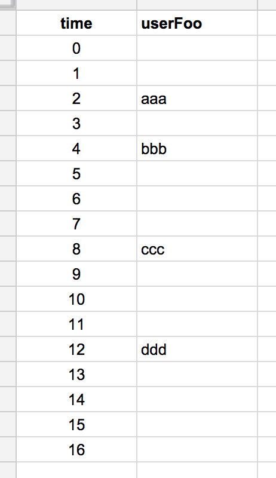
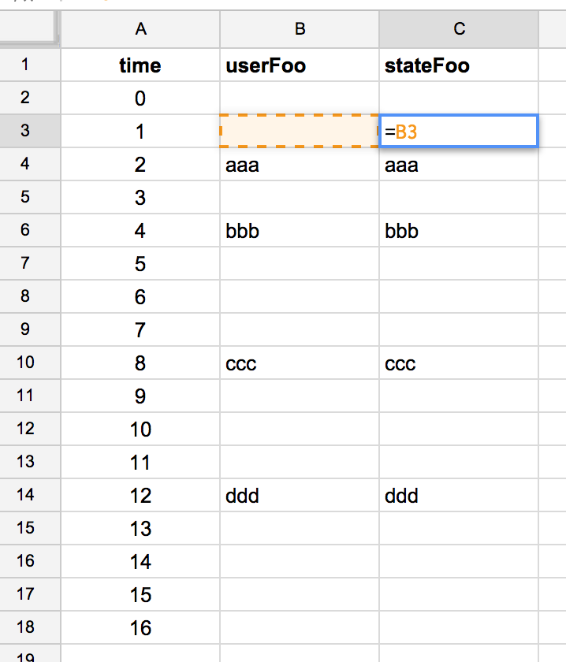
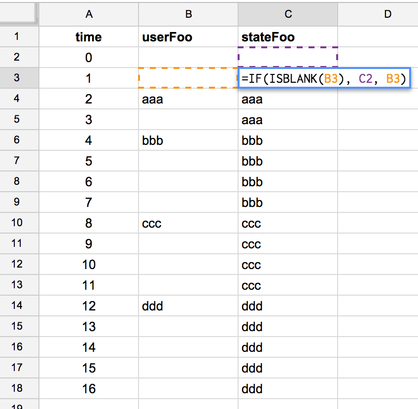
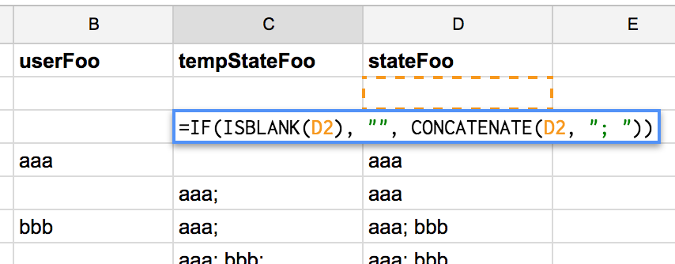
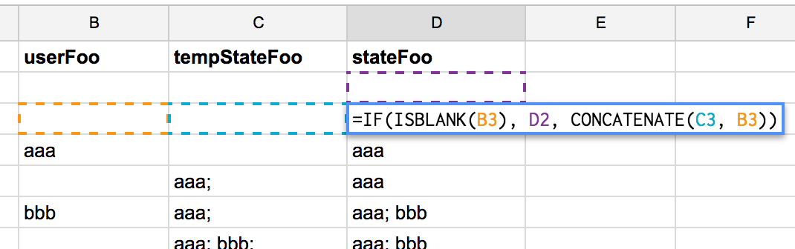
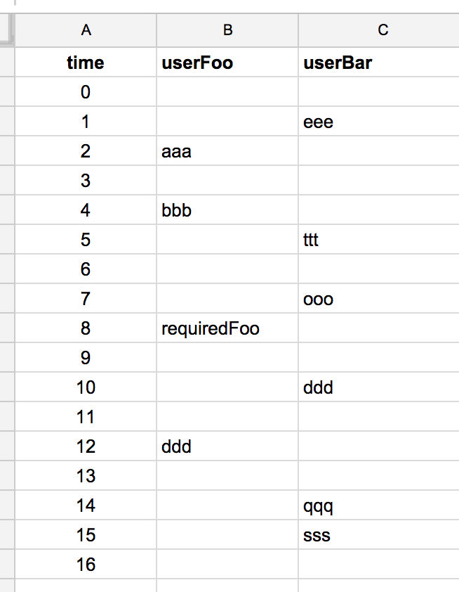
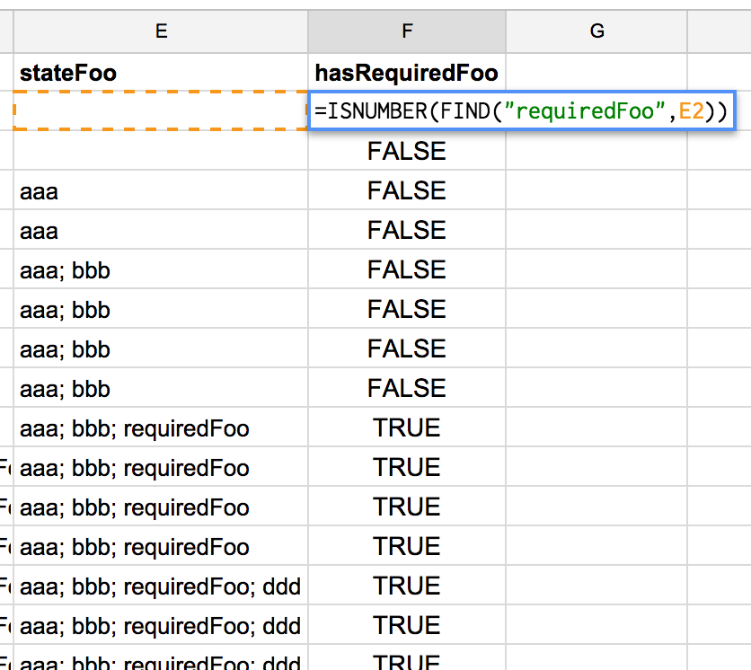
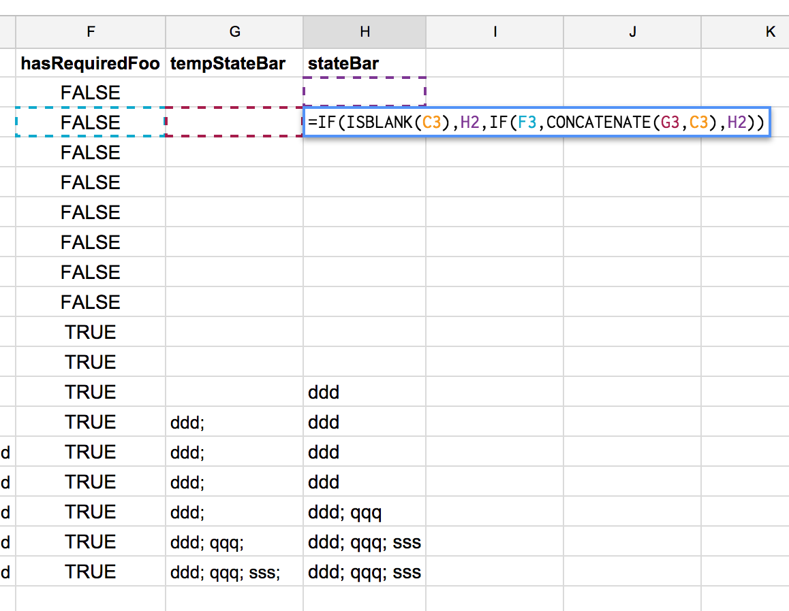
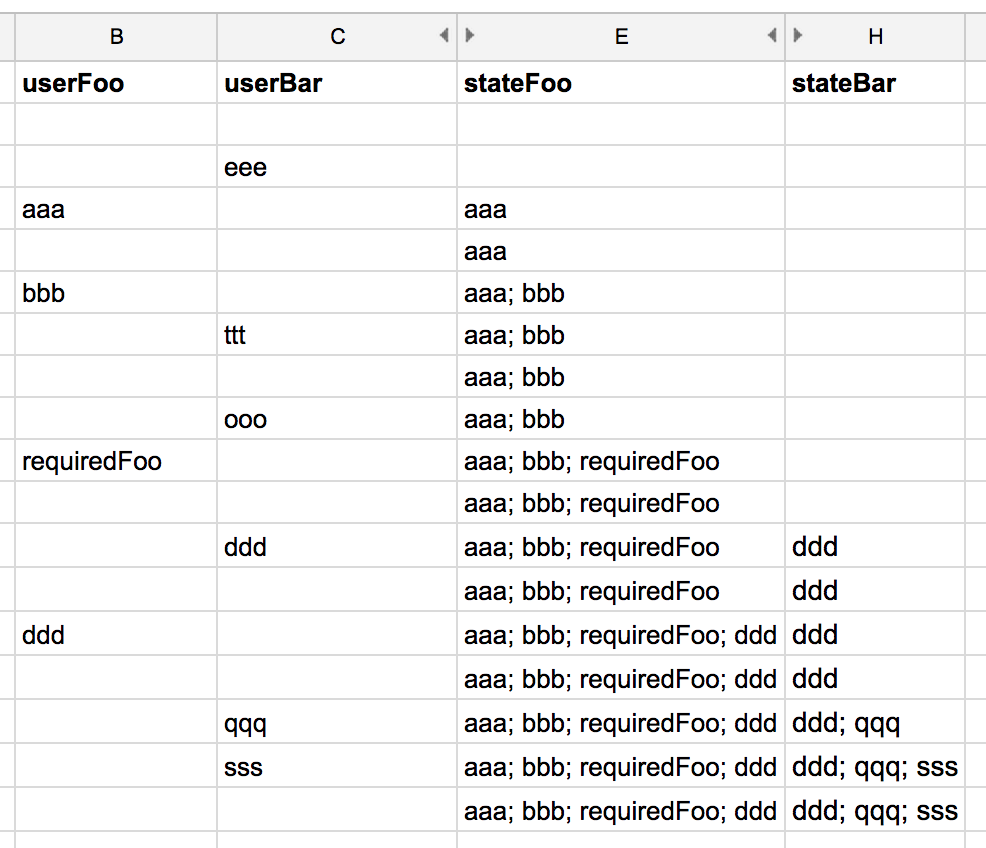

I worked for three years as a Risk Management Consultant.   That, as you can imagine, meant I spent a lot of time working with spreadsheets.
For the most part, Excel was the main spreadsheet platform that was used by the businesses that I interacted with.

I remember reading somewhere "spreadsheets are functional programming!", but for some reason I was never very interested in going further until I watched [Felienne Hermans' talk on Strange Loop 2004](https://www.youtube.com/watch?v=0CKru5d4GPk), where she implements selection sort with a spreadsheet and, believe it or not, even showed an implementation of a Turing machine with spreadsheets!

In general, every cell of a spreadsheet is either a *value* or a *pure function that takes other cells as inputs*. If we restrict it to only that, we can say that a spreadsheet is a platform for functional programming. In this post, I'll describe my experimentation with a Google Spreadsheet to model user interactions and state handling.

## State handling when there are no mutable variables

If we only use pure functions to build our programs, we can benefit from a lot of cool things like modularity, lazy evaluation, and so on. It is relatively easy if we are implementing a mathematical model, or a compiler, for instance. They have well defined inputs and outputs, but things start getting more complex if we have a program that runs for a period of time, and reacts to user interaction. Is it possible to maintain purity in such a scenario?

The standard way of dealing with it is by mutating objects according to user interactions. It can be done in a lot of ways, and in my main project we are [keeping all state in a single object, and reacting to changes in it](../a-more-functional-approach-to-angular/). We find it much more manageable than the standard object oriented way, which deals with a lot of "models" that keep hidden internal local state.

This time I'm gonna try to handle state by using *streams*. That means that I'll model user interactions *and* application state as streams of information.

## State and interaction as functions of time

So, let's start with a basic spec: the user inserts a string, and we have an application state that reacts to it by replicating this input. Let's call it Foo:

```
t = given moment in time

userFoo(t) = user string input in t

stateFoo(t) = foo state in t
```

So, what I'm doing here is *thinking of both interactions and application state as functions of time*. Let's detail more `stateFoo`:

```
stateFoo(t) = f(userFoo(t))
```

In this case, the application state will depend only on the current user interaction. To keep it really simple, let's define:

```
stateFoo(t) = userFoo(t)
```

And now let's implement it in a spreadsheet!

## Modelling time in a spreadsheet

Back in my consultant days, I was dealing with a lot of [time series analyses](http://en.wikipedia.org/wiki/Time_series), and the way we were dealing with time was simple: one line for every event. Let's start with sixteen "time samples" and some user interactions:



That means that on time `t = 2` the user submitted the input "aaa", when `t = 4 ` the user submitted the input "bbb" and so on.

`stateFoo` can be implemented then as a new column:



That function ("formula" in spreadsheet) is repeated for every line, so every cell in the `stateFoo` column equals the corresponding cell from the same line in the `userFoo` column.

That was really simple and easy! Now let's implement a more interesting spec. Let the application state be the *last* Foo that was input by the user. Now, `stateFoo` does not only depend on `userFoo`, but it also depends on the past value of `stateFoo` itself!

```
stateFoo(t) = f(
  userFoo(t),
  stateFoo(t - 1))

stateFoo(t) =
  if (userFoo(t) is blank)
    return stateFoo(t - 1)
  else
    return userFoo(t)
```

So, if the user inputs something, `stateFoo` changes. If the user does not input anything, `stateFoo` repeats its last value. We can see it in the spreadsheet:



Now state looks more like the state we usually have in applications. Let's bring one more complexity: let the state carry *all previous values*.
I want the state to be a string that's the concatenation of every past user input, joined by `";"`. A good start would be:


We can see the problem: as soon as the user inputs the first string, the state becomes `; aaa`. That error propagates to all future states. There are a lot of ways to solve this issue, but I'll use the one that I think is the simplest: I'll implement a new column that concatenates `";"` to every past state, unless it is empty. So, if we have to concatenate a new input, we concatenate to this value:





And there we have it; a state that reflects the whole application history.

## Interaction between streams

Let's recap: a stream is a function of time; given time = `t`, a stream would have the value `f(t)`. We are modelling user input as streams. Application state would then be transformations of user input streams.

One nice property of streams is that they can also be transformations of other streams, and past values of themselves. Let's illustrate this with another application state: the Bars.

The Bars work the same way as the Foos, but with one additional spec: the user can only add a new Bar after the Foo `requiredFoo` is input:

```
stateBar(t) = f(
  userBar(t),
  stateBar(t - 1),
  stateFoo(t));
```

Back to our spreadsheet, let's implement the user interactions streams again:



The interaction between Foos and Bars will be done with the `hasRequiredFoo` stream:

```
hasRequiredFoo(t) =
  stateFoo(t) contains "requiredFoo"
```

For simplicity, let's assume `contains` means "has substring `"requiredFoo"`":



And `stateBar` logic would be:

```
stateFoo(t) =
  if (userBar(t) is blank or
      not hasRequiredFoo(t))
    return stateBar(t - 1)
  else
    return concat(
      userBar(t),
      stateBar(t - 1))
```


*(in the above image, the "C" column refers to userBar)*

And it's ready! :)

Now just the inputs and application state streams:



## Conclusions

I found this experiment very helpful and even entertaining! Now I understand what "spreadsheets are functional programming!" means, and I agree with it. Actually, I think spreadsheets could be a nice learning environment to start "thinking functionally". It certainly helped me learn the "state as streams" concept.

Everybody interested in the subject should watch [Felienne Hermans' talk on Strange Loop 2004](https://www.youtube.com/watch?v=0CKru5d4GPk). That was her PhD research subject, and she brings spreadsheet programming to a whole new level.

## Next Steps

The next obvious step for me is implement the "state as streams" concept using javascript. There are libraries that claim to help with this, like [RxJS](http://reactivex.io/), [BaconJS](https://baconjs.github.io/) and the more recent [Flyd](https://github.com/paldepind/flyd). I've also been reading about a beta framework based on RxJS and [virtual-dom](https://github.com/Matt-Esch/virtual-dom) called [CycleJS](https://github.com/staltz/cycle), which looks promising.

The link to the complete spreadsheet used in this post is [here](http://goo.gl/i1g3uP).