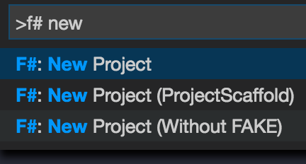
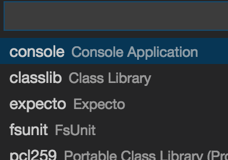
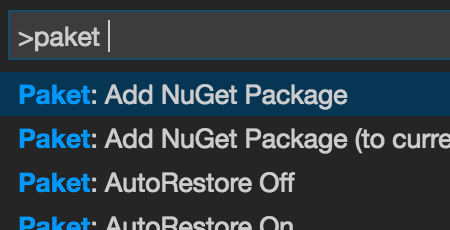
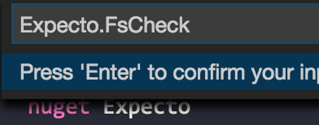
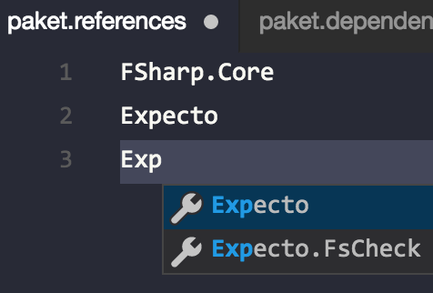
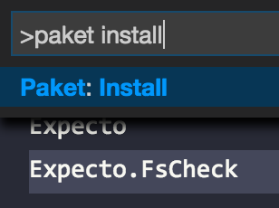

*This is part 1 of a series:*

* [Part 2: Evolving Models](http://lucasmreis.github.io/blog/type-driven-domain-modelling-part-2/)
* [Part 3: One More Spec Change](http://lucasmreis.github.io/blog/type-driven-domain-modelling-part-3/)


A while ago I saw this tweet:

<div style="display: flex; justify-content: center">
  <blockquote class="twitter-tweet" data-lang="en"><p lang="en" dir="ltr">Every system tends towards complexity, slowness and difficulty<br>Staying simple, fast and easy-to-use is a battle that must be fought everyday</p>&mdash; Guillermo Rauch (@rauchg) <a href="https://twitter.com/rauchg/status/813529770059186176">December 26, 2016</a></blockquote>
  <script async src="//platform.twitter.com/widgets.js" charset="utf-8"></script>
</div>

I work daily in big javascript projects, so I get where Guillermo is coming from. Javascript doesn't have types, and doesn't enforce immutability, so the following things tend to happen in almost every project I've come across:

1. The first version is (most of the time) clean and simple. Well chosen libraries being used with the best practices.
2. As a project grows, big refactorings begin to become more and more "dangerous". There's always the risk of having a runtime error that was not caught in dev, and will be caught in production.
3. New changes, then, become small refactorings, mostly *thin layers of code* over previous code. A lot of null / undefined testing takes place, unit tests are corrected, and new ones are written.

These thin layers of code end up adding bits of complexity to the code. At first it's manageable, but, months later, the project starts getting more and more difficult to change. The worst effect on these projects is losing *reliability* and *safety*: we are not sure the application does what we want it to do, and we are not sure if any hidden bugs will make it to production.

Of course, there are tools to help us deal with this complexity. We've been using Typescript at work for a while now, and it has been great. But, from [my previous](http://lucasmreis.github.io/blog/learning-elm-part-1/) [experiments here](http://lucasmreis.github.io/blog/does-elm-harmonize-with-f/#/) [in the blog](http://lucasmreis.github.io/blog/from-elm-to-fable/), I still think that a "stronger typed" language could help much more to avoid this type of complexity-piling.

So, in this post series, I'll model a simple e-commerce basket using F#. Then I'll change the specs and add features of this model, and try to maintain reliability and simplicity in the code. Let's start!

## Specs

Let's keep the first spec simple: the user can add a quantity of a product to his basket, he should have access to the current state of the basket, with a calculated total.

The next version should contemplate what I'll call *quantity promotions*; it's the classic *buy 3 pay $10*, *buy 2 pay 5* kind of promotion.

On version 3, not only the final price should be shown to the user, but it should also show the price *without considering the promotions*, and how much discount was given in that product.

On version 4, and final version (maybe?), we should also tell the user, for each line "if you buy another 2 of these, you'll have an added discount of X!". This tip will be based in the quantity promotions of each product.

## Initial Setup

I'll use [VS Code](https://code.visualstudio.com/) editor with the [Ionide](https://github.com/ionide/ionide-vscode-fsharp) extension to start a new project. I chose to start an "Expecto" project, since it already has a test file configured:

<div style="display: flex">
  <div style="padding-right: 10px">
    
  </div>
  <div>
    
  </div>
</div>

After the project is created, we need to create a new file. I created a `Domain.fs` file inside the project folder, together with the `Main.fs` and `Tests.fs` that were there. Now - and this is particular to F# - the file needs to be *added to the project*. In every F# project, we need to specify not only the files to be compiled, but the *order in which they should be compiled*. That may sound weird and too old-school, but today I agree that [its a good thing](https://fsharpforfunandprofit.com/posts/cyclic-dependencies/), since it helps to avoid circular dependencies among other problems.

So, to add it, open the `.fsproj` file in the project folder. It's a big messy XML, I know :) The file ordering is easy to do, though. Just search for the `Main.fs` file, and you'll find this XML node:

```XML
<ItemGroup>
    <Compile Include="Tests.fs" />
    <Compile Include="Main.fs" />
    <None Include="App.config" />
</ItemGroup>
```

The `Domain.fs` file needs to be compiled before the other files, so we only need to change the config to:

```XML
<ItemGroup>
    <Compile Include="Domain.fs" />
    <Compile Include="Tests.fs" />
    <Compile Include="Main.fs" />
    <None Include="App.config" />
</ItemGroup>
```

This way our file is going to be compiled first, and we can use it in the tests and in the main function.

## Starting With The Domain

Now we can start to code our model in the `Domain.fs` file:

```fsharp
module Domain

type Product = {
    sku: string
    price: int
}

type Event =
    | AddToBasket of Product * int
```

The first thing I don't like about this modelling is that we're using `int` for the price, and we're also using `int` for the quantity in the event. The latter is especially bad, since it's not clear that it means the quantity of products added to the basket. One way of making it better and more explicit would be:

```fsharp
type Sku = string
type Price = int
type Qty = int

type Product = {
    sku: Sku
    price: Price
}

type Event =
    | AddToBasket of Product * Qty
```

Much better, right?

*Observation*: I'm using int as the price unit because I know that in the first specs I only have to sum and subtract prices. In these situations, I think an integer representing cents are enough. Things get hairy when dividing money, and other more complex conversions. When our model needs that, we will probably need to change from `int` to something else.

## The Basket Read Model

The user should have access to the current state of the basket, and to the total he or she will have to pay. Let's first define a *line*, which is a combination of a sku, a quantity and a total price:

```fsharp
type Line = {
    productSku: Sku
    quantity: Qty
    lineTotal: Price
}
```

Now, the basket read model can be defined as a list of lines and a total to be paid:

```fsharp
type Basket = {
    lines: Line list
    total: Price
}
```

I consider these to be good initial types. Let's start with these, and make changes when we see the need.

The basket will be built by an `update` function, that takes a basket and an event as parameters, and returns an updated basket:

```fsharp
let empty = { lines = [] ; total = 0 }

// wrong implementation so
// we can write our test;
// this is our main function!
let addToBasket product basket = empty

let update basket event =
    match event with
    | AddToBasket(product, quantity) ->
        addToBasket product basket
```

## The First Tests

Before starting the tests, let's think about some properties of our basket. One good property is *if there's only one line in our basket, it's total must be the same as the basket's total*. Let's write a test that makes sure this property holds.

First, we need to install `Expecto.FsCheck`, which is the library that let's Expecto run [property based tests](http://lucasmreis.github.io/blog/learning-elm-part-4/). With the `paket.dependencies` file opened, run the *Add Nuget Package* command to install the package:

<div style="display: flex">
  <div style="padding-right: 10px">
    
  </div>
  <div>
    
  </div>
</div>

Now that the package is installed, we need to add the dependency in the project. Open the `paket.references` file, and add `Expecto.FsCheck` to the list of dependencies. Then run the install command from Paket:

<div style="display: flex">
  <div style="padding-right: 10px">
    
  </div>
  <div>
    
  </div>
</div>

Now, in the `Tests.fs` file, let's write the following test:

```fsharp
open Domain

[<Tests>]
let tests =
    testList "basket promotions" [
        testProperty "total of single line" <| fun (quantity : Qty ) (price : Price) ->
            let prod = { sku = "a" ; price = price }
            let event = AddToBasket(prod, quantity)
            let basket = update empty event

            let lineTotal = basket.lines.Head.lineTotal
            let basketTotal = basket.total

            Expect.equal lineTotal basketTotal "must be the same as basket total"
    ]
```

That's the first property to our model that we're going to test. Another property is *whenever a new product is added, if it's already in the basket, the number of lines stays the same*:

```
testProperty "adding product multiple times downto the basket" <| fun (N : uint16 ) ->
    let prod = { sku = "sku" ; price = 10 }
    let event = AddToBasket(prod, 1)
    let basket =
        [1..(int N + 1)]
        |> List.map (fun _ -> event)
        |> List.fold update empty

    Expect.equal basket.lines.Length 1 "must have one line"
```

Note the use of `N : uint16` in the parameter. I chose it because of the range: it goes from 0 to 65535, so it's never negative, and it has a reasonable range for this application. Calling `(int N + 1)` converts it to the desired type and range.

And, of course, the property *if we add N different products, our basket will have N lines*:

```fsharp
testProperty "adding multiple products to the basket" <| fun (N : uint16 ) ->
    let prod (num : int) = { sku = "sku" + num.ToString() ; price = 10 }
    let event (num : int) = AddToBasket(prod num, 1)
    let basket =
        [1..(int N + 1)]
        |> List.map event
        |> List.fold update empty

    Expect.equal basket.lines.Length (int N + 1) "must have N lines"
```

These tests seem enough to make sure the function is reliable. If you have any ideas for other basket properties that could be tested, or even some unit tests that seem important, please let me know in the comments!

## The Function

The `addToBasket` function should be straightforward: it should add a line with the selected quantity and sku and the calculated total. Then it should calculate the basket total by summing the line totals. The only "gotcha" is that, if the product is already in the basket, the corresponding line should be updated.

So, I'll start with two helper functions:

```fsharp
let buildLine product quantity = {
    productSku = product.sku
    quantity = quantity
    lineTotal = quantity * product.price
}

let basketTotal lines =
    lines
    |> List.map (fun l -> l.lineTotal)
    |> List.sum
```

Now, for the actual function, I'll use this strategy: I'll *transform* the Line list so that a line with the same sku as the product being added gets updated. If this transformed list is different than the original line list, that means that the product was already in the basket! If the transformed list is the same, that means we only need to append a new line to the list:

```fsharp
let addToBasket product quantity basket =
    let transformLine line =
        if line.productSku = product.sku
        then buildLine product (line.quantity + quantity)
        else line

    let transformedLines =
        basket.lines
        |> List.map transformLine

    let productAlreadyInBasket =
        transformedLines <> basket.lines

    let lines =
        if productAlreadyInBasket
        then transformedLines
        else (buildLine product quantity)::basket.lines

    { basket with lines = lines ; total = basketTotal lines }
```

Now run the Expecto tests, and voilá! Everything is working :)

## Conclusions

It's incredible how reliable your code can feel when it's written in a strong typed language with some property tests. This is a trait of ML-type languages like F#, Haskell, Ocaml and Elm, and I think this is the the direction we should look in when looking for reliability and safety.

Speaking on F# in particular, it's a very "agile" developing experience. Good type inferring, with the tooling that Ionide provides, makes it very easy and quick to experiment with different ways of writing the same thing, while still maintaining correctness through types.

Another good surprise was Expecto, and how easy it was to setup, write and run the tests - even the property based ones.

The final code can be found [here](https://github.com/lucasmreis/basket-promotions-kata/blob/master/BasketPromotions/Domain.fs), and the tests [here](https://github.com/lucasmreis/basket-promotions-kata/blob/master/BasketPromotions/Tests.fs).

## Next Steps

Now that we have a simple model working, it's time to change the specs and add new features. In my next update I'll add promotions to the products. Stay tuned!

And, as always, I'm constantly learning - and would love to know if some of you have any ideas on how to better implement these specs, or if there's any library or framework that I'm missing and would make my life easier. Thanks in advance :)
