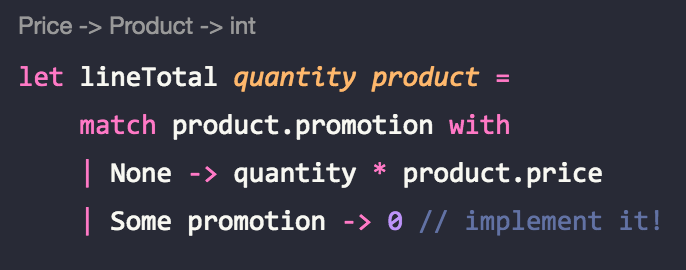
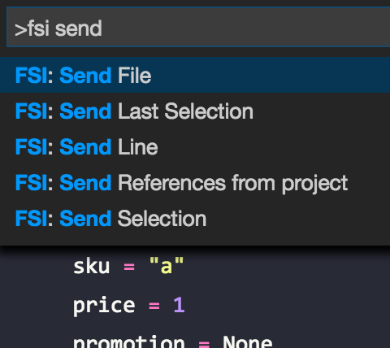

*This is part 2 of a series:*

* [Part 1: Types And Property Testing](http://lucasmreis.github.io/blog/type-driven-domain-modelling-part-1/)
* [Part 3: One More Spec Change](http://lucasmreis.github.io/blog/type-driven-domain-modelling-part-3/)

We wrote our initial domain in part 1. The user produces an event called `AddToBasket`, with a product and a quantity. Then we wrote a function that takes a list of events, and produces a read model to send to the client to be rendered.

In this second part we'll add *promotions* to products, and make sure total calculations are right!

## Spec

In the second part of the series, we'll add what I call *quantity promotions*: they are the classic "buy N for X". For instance, an item costs $3, but we can buy 2 for $5. This is the promotion we're going to model in this post.

## Modelling A Promotion

*The starting point for this code is [here](https://github.com/lucasmreis/basket-promotions-kata/blob/master/BasketPromotions/DomainPart1.fs).*

First, let's start with the Promotion itself, and add it to the Product type:

```fsharp
type Promotion = {
    promoQty: Qty
    promoPrice: Price
}

type Product = {
    sku: Sku
    price: Price
    promotion: Promotion option
}
```

It's modeled as an Option, since not all products have a promotion.

With that in mind, we need to change the `buildLine` function to account for promotions. Let's build a function to calculate the total of a line, given a product and a quantity:

```fsharp
let lineTotal quantity product =
    match product.promotion with
    | None -> quantity * product.price
    | Some promotion -> 0 // implement it!

let buildLine product quantity = {
    productSku = product.sku
    quantity = quantity
    lineTotal = lineTotal quantity product
}
```

Everything is working up to this point, but one thing bothers me: because both `Qty` and `Price` are aliases for `int`, the inferred types are often confused:



We could fix this particular case by "forcing" a `Qty` type to `quantity`, but I think there's a bigger message here: quantity and price are *not* the same thing!

Within our domain, there is one property of quantity that can help us model it: *it's never negative*. Another property is that it has to be able to do some arithmetic; we need to be able to sum and divide quantities at least.

Looking through the [primitives of F#](https://docs.microsoft.com/en-us/dotnet/articles/fsharp/language-reference/primitive-types), I found one that can help us: *unsigned ints*! I think that `uint16` is a good choice, since it's a integer with a 0 - 65535 range. As a bonus, it also has all the arithmetic between `uint16` implemented:

```fsharp
type Sku = string
type Price = int
type Qty = uint16
```

## Calculating Totals

Now, we can right away see an error in the `lineTotal` call, since it is inferring that it takes a `Price`, and not a `Qty`. Before fixing it, I can see that we're gonna need an important functionality: we need to be able to multiply a quantity by a price! And it needs to return a price. This is a key function in our domain, so let's implement it:

```
// super cool custom operator!
let (*) (qty : Qty) (price : Price) : Price =
    int qty * price

let lineTotal quantity product =
    match product.promotion with
    | None -> quantity * product.price
    | Some promotion -> 0 // implement it!
```

Much cleaner. Now, the difficult part: actually calculating the total of a line, when the product is promoted. Let's do some TDD-ish programming, since it's easy to make some mistakes in calculations like these. First, a stub of the function itself:

```fsharp
// Domain.fs
let promotedTotal quantity price promotion = 0

// Tests.fs
(...)

testProperty "promoted line total" <| fun (N : Qty) ->
    let promoQty = N + 2us // notation for unit16
    let promotion = { promoQty = promoQty ; promoPrice = 7 }
    let promoted = promotedTotal promoQty 10 promotion

    let notPromoQty = N + 1us
    let notPromoted = promotedTotal notPromoQty 10 promotion

    let promotedExpected = 7
    let notPromotedExpected = notPromoQty * 10

    Expect.equal promoted promotedExpected "same price as promotion"
    Expect.equal notPromoted notPromotedExpected "multiplied by regular price"
```

I also had to correct the other tests to work with the new `Product` and `Price` types. The final version of the test file is [here](https://github.com/lucasmreis/basket-promotions-kata/blob/master/BasketPromotions/Tests.fs). Fixing these errors is very direct, since it only involves "getting rid of the red underlinings" that Ionide + the compiler signal. It's never - ever - that easy in JS, or any other dynamic language for that matter. It's a much more stressful activity, and stressful activities drain your energy.

The test is simple: if I have a promotion "buy N for $7", if I add N to the basket, my total is 7. If I add N - 1, my total is (N - 1) * unit price. (I use `N + 2us` here to guarantee that I don't have any unwanted zeros).

Now, the implementation:

```fsharp
let promotedTotal quantity price promotion =
    let promotedQty = quantity / promotion.promoQty
    let promotedTotal = promotedQty * promotion.promoPrice

    let notPromotedQty = quantity % promotion.promoQty
    let notPromotedTotal = notPromotedQty * price

    promotedTotal + notPromotedTotal

let lineTotal quantity product =
    match product.promotion with
    | None -> quantity * product.price
    | Some promotion -> promotedTotal quantity product.price promotion
```

Run the Expecto tests, and there we have it! Working totals :)

## Experimenting With The Domain

Even though the project has no compile errors and the tests are ok, it's still good practice to experiment with the types and functions. At the very least you will be able to rest easy seeing that everything is working, right?

A good way of doing this is by creating a script file, including our Domain module, and just sending code to F# Interactive. For instance, I created a `Experiments.fsx` file, with the following contents:

```fsharp
#load "Domain.fs"

open Domain

let productA = {
    sku = "a"
    price = 1
    promotion = None
}

let productB = {
    sku = "b"
    price = 2
    promotion = Some {
        promoQty = 3us
        promoPrice = 5
    }
}

let events = [
    AddToBasket(productA, 5us)
    AddToBasket(productB, 7us)
    AddToBasket(productA, 4us)
]

let myBasket = List.fold update empty events
```

I created a couple of products, one with a promotion. Then I created a series of events, and built a basket with it. With Ionide it's easy to run:



Now we can play with different products and events, and check the results!

## Conclusions

Changing F# code is so smooth, it's almost fun. And this is a good thing - it's a sign that it does not *drain a lot of energy* from the developer. We can focus on the models and algorithms without using a lot of energy with silly errors from the changes we're making.

Whenever we do a lot of cognitive-intense work, we get tired. There's no escape to that. And when we get tired, we make mistakes. In the projects I've worked on, I think 90% of the simple errors that were deployed to production were deployed by tired developers. So, that's another positive contribution from F# and its tooling and ecosystem to a project's *safety*, in the sense that *no unwanted accidents happen in production*.

The final code for the domain is [here](https://github.com/lucasmreis/basket-promotions-kata/blob/master/BasketPromotions/Domain.fs), and the final code for the tests are [here](https://github.com/lucasmreis/basket-promotions-kata/blob/master/BasketPromotions/Tests.fs).

## Next Steps

Imagine we want not only to show the calculated totals, but we also want to show to our users *how much they are saving* on each line, and in the basket as a whole. I'll cover this in Part 3 of this series!